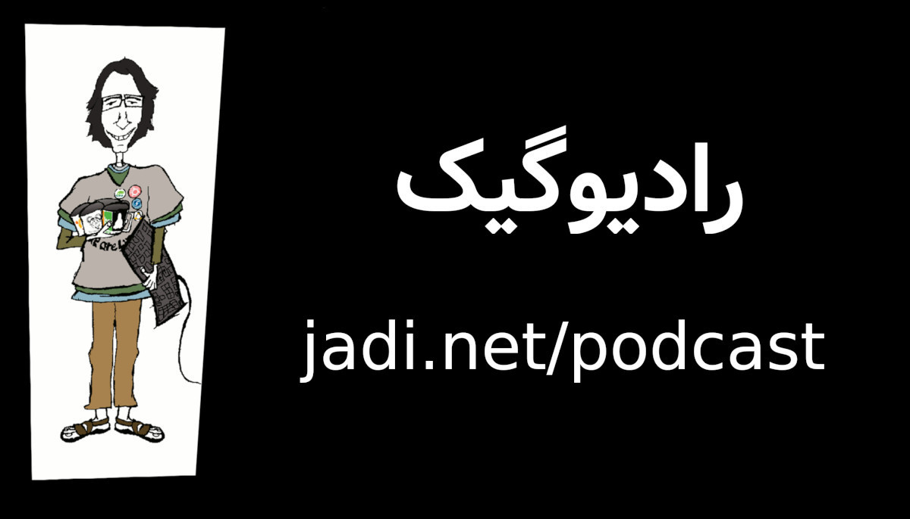

## تقدیم نامه

تقدیم کردن یک وبلاگ ممکنه ایده عجیبی به نظر بیاد اما به این فکر کنین که ممکن بود همین من، تصمیم بگیرم همین مطالب رو توی یک کتاب منتشر کنم. اونوقت می‌تونستم کتابم رو به هرکسی که بخوام تقدیم کنم و تنها فرقش درختایی بودن که قطع می‌شدن و خواننده‌هایی که باید بابت قطع شدن اون درخت‌ها پول هم پرداخت می‌کردن.
پس بزارین اجازه داشته باشم وبلاگم رو تقدیم کنم تا هم درختی قطع نشه،‌ هم شما مجبور نشید بابت خوندن همین مطالب پول پرداخت کنین.

و اگه بخوام این وبلاگ رو تقدیم کنم،‌ بدون شک اون رو به «
[رادیو گیک](https://www.bloock.ir/)
»
تقدیم می‌کنم که صدای نرم‌افزارهای آزاد توی ایرانه.به قول خودش:

> رادیوگیک یک حرکت‌گاه رادیوییه و مخاطبش کسانین که می‌خوان در تقاطع تکنولوژی و جامعه بشینن و به ارزش‌های انسانی فکر کنن

سال‌ها پیش این رادیو گیک بود که من رو به صورت جدی با موضوع اخلاقیات تکنولوژی آشنا کرد. برای اندیشیدن درباره تکنولوژی ها و تأثیرات اون‌ها در جامعه بهم چهارچوب داد و در نهایت تشویقم کرد تا به دنیای زیبای «نرم‌افزارهای آزاد» بپیوندم. رادیو گیک نه مثل استالمن بزرگ خیلی «دوره»،‌ نه مثل جادی خیلی «چندمنظوره»، نه مثل خیلی چیزهای دیگه «صرفا جهت سرگرمی».
پس این وبلاگ رو با تمام محتویاتش به « رادیوگیک » تقدیم می‌کنم، به امیدی که باشه و بازم برامون محتوای جذاب بسازه.
