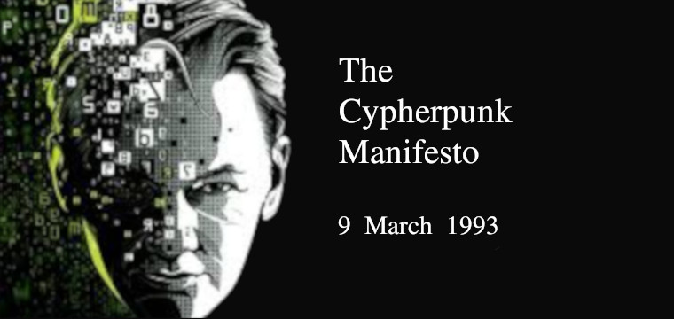

##مانیفست «سایفرپانک»

«سایفرپانک» یک فعال اجتماعی است که با استفاده گسترده از رمزنگاری و و دفاع از حریم خصوصی ، از تغییرات اجتماعی و سیاسی حمایت می‌کند.این جنبش که در ابتدا توسط لیست‌های ایمیلی در گروه‌های غیر رسمی و با هدف دستیابی به امنیت و حریم خصوصی از طریق استفاده پیشگیرانه از رمزنگاری آغاز شد در اواخر ۱۹۸۰ به یک جنبش فعال تبدیل شد.

در ادامه مانیفست این گروه، که توسط
`اریک هیوز`
و در سال ۱۹۹۳ نوشته شده است را مشاهده می‌نمایید:

یک جامعه باز در عصر الکترونیک نیاز مبرمی به «حریم خصوصی» دارد. حریم خصوصی با «محرمانگی» فرق دارد. «حریم خصوصی» به مواردی می‌پردازد که فرد نمیخواهد «همگان» از آن باخبر باشند، اما «محرمانگی» مربوط به موضوعاتیست که نمیخواهیم «هیچکس» درباره آن‌ها بداند. حریم خصوصی قدرتی است که به ما امکان می‌دهد، خود را همانقدری که می‌خواهیم بر جهان آشکار کنیم.

اگر دو طرف باهم معامله ای داشته باشند،‌ هردو از آن معامله خاطراتی خواهند داشت که می‌توانند درباره آن برای دیگران صحبت کنند. و این درحالیست که ممکن است دیگری آن را نپسندد. چطور می‌توانیم از این اتفاق جلوگیری کنیم؟ می‌توانیم بر ضد آن قانونگذاری کنیم،‌ اما «آزادی بیان» بسیار مهمتر از «حریم خصوصی» است،‌ چون اساس یک «جامعه باز» را تشکیل می‌دهد؛ ما نمی‌خواهیم که هیچ سخنی را محدود کنیم. اگر هر طرف هر معامله ای، اطلاعات خود درباره آن را در یک «فروم» مشترک افشا کند،همه می‌توانند از طریق این اطلاعات «حالا به هم پیوسته»،‌ به اطلاعات زندگی شخصی سایر اعضا دسترسی پیدا کنند. قدرت ارتباطات الکترونیکی به وجود آوردن چنین گروه‌هایی را ممکن نموده است و ما نمی‌توانیم با نخواستن چنین گروه‌هایی،‌ از به وجود آمدنشان جلوگیری کنیم.

حال که «حریم خصوصی» را می‌خواهیم، باید اطمینان حاصل کنیم که هر طرف معامله تنها اطلاعاتی را دریافت کند که برای آن معامله ضروریست. از آنجایی که درباره هر اطلاعاتی می‌توان سخن گفت،‌ باید مطمئن شویم که تا حد ممکن اطلاعات کمتری را افشا می‌کنیم. در بیشتر موارد گرفتن اطلاعات شخصی ضروری نیست. وقتی من یک مجله را از یک فروشگاه می‌خرم و قیمت آن را نقدی می‌پردازم،‌ هیچ‌کس نیازی ندارد بداند که من کیستم. سرویس دهنده اینترنت من برای آنکه ایمیل و پیام‌های اینترنتی من را از طرف من به آن‌ها یا از آن‌ها به من برساند،‌ نیاز ندارد بداند ما کیستیم و چه می‌گوییم؛ برای او کافیست که روش رساندن پیام‌ها و هزینه آن‌ها را بداند. اگر هویت من توسط مکانیزم‌های ضمنی آشکار شود دیگر حریم خصوصی ای نخواهم داشت. دیگر نخواهم توانست خود را به دلخواه آشکار کنم. من همیشه برای دیگران آشکار خواهم بود.

بنابراین،‌ حفظ حریم خصوصی در یک جامعه باز، نیازمند سامانه‌هایی است که تراکنش‌های «گمنام» را ممکن سازند. این سیستم تا به حال «پول نقد» بوده است. توجه کنید که «پرداخت گمنام» با پرداخت «محرمانه» متفاوت است. پرداخت گمنام، افراد را قادر می‌سازد تا هویت خود را به دلخواه آشکار کنند و این اساس «حریم خصوصی» است.

حریم خصوصی در جامعه باز نیازمند «رمزنگاری» است. من دوست دارم هرچه می‌گویم، تنها توسط کسانی که خود می‌خواهم شنیده شود. اگر محتوای گفتگوی من برای همه جهان در دسترس باشد،‌ من دیگر حریم خصوصی ندارم. تمایل به «رمزنگاری» نشانگر تمایل به «حریم خصوصی» است و اگر «رمزنگاری» به صورت ضعیف انجام شود، بیانگر آن است که اراده ای برای حفظ «حریم خصوصی» وجود ندارد. علاوه بر این در حالتی که «گمنامی» به صورت پیشفرض فعال باشد،‌برای اینکه امکان آشکار شدن هویت را به افراد بدهیم احتیاج به امضای رمزنگاری داریم.

ما نمی‌توانیم از دولت‌مردان،‌ کمپانی‌ها و سایر بنگاه‌های بزرگ بی نام و نشان انتظار داشته باشیم «حریم خصوصی» را به ما هدیه دهند.منافع آن‌ها در همین است که بتوانند درباره اطلاعات ما صحبت کنند. مبارزه با صحبت‌های آنان مبارزه علیه طبیعت اطلاعات خواهد بود. اطلاعات نه تنها می‌خواهد آزاد باشد، بلکه باید هم همینگونه باشد. اطلاعات گسترش می‌یابد تا تمام فضای موجود را پر کند. اطلاعات پسرعموی جوان‌تر و قوی‌تر شایعه است. ؛او تیزپاست، چشمان بیشتری دارد، بیشتر می‌داند و البته کمتر از شایعه می‌فهمد.

اگر ما حریم خصوصی می‌خواهیم باید برایش اراده داشته باشیم. ما باید دست به دست هم سیستم‌هایی بسازیم که اجازه دهند به صورت گمنام معامله کنیم. قرن‌هاست که مردم با استفاده از نجوا،‌ تاریکی، پاکت‌های نامه، درهای بسته، اشارات رمزی و قاصد‌ها از حریم خصوصیشان دفاع کرده اند. تکنولوژی‌های گذشته امکان قوی‌تری برای دفاع از این حق نمی‌دادند، اما تکنولوژی‌های الکترونیکی متفاوتند.

ما «سایفرپانک»ها خود را وقف ساختن سامانه‌های گمنامانه خواهیم کرد. ما از حریم خصوصیمان با رمزنگاری، سامانه‌های ارسال گمنامانه‌ی پیام، امضای دیجیتال و پول الکترونیک دفاع خواهیم کرد.

سایفرپانک‌ها کد ‌می‌نویسند. ما می‌دانیم که بالاخره کسی باید نرم‌افزارهایی بنویسد که از حریم خصوصی محافظت کند. این کار را می‌کنیم چون می‌دانیم،‌نمی‌توانیم حریم خصوصی داشته باشیم مگر برای همه. ما کدهایمان را منتشر می‌کنیم تا یاران سایفرپانکمان با آن‌ها تمرین و بازی کنند. کدهای ما برای هر استفاده‌ای و برای هر جای دنیا آزاد هستند. هیچ اهمیتی ندارد که نرم‌افزارهایمان را تایید نکنید. ما می‌دانیم که نرم‌افزارها نابود نمی‌شوند و سیستمی که به اندازه کافی گسترده شود را نمی‌توان متوقف نمود.

سایفرپانک‌ها از وضع مقررات برای رمزگذاری بیزارند، زیرا رمزگذاری اساساً یک عمل شخصیست. رمزگذاری اطلاعات خصوصی را از فضای عمومی حذف می‌کند. قوانین علیه رمزنگاری تا به مرزهای سیاسی کشورها و قدرت اعمال خشونتشان وسعت می‌یابند.

گسترش رمزنگاری به تمامی جهان گریزناپذیر است و همراه با آن،‌ «تراکنش‌های گمنام» ممکن خواهند شد. حریم خصوصی برای همه‌گیر شدن باید بخشی از یک قرارداد اجتماعی باشد. مردم باید دست در دست یکدیگر چنین سامانه‌هایی بسازند. حریم خصوصی هر فرد تا زمانی که یارانش او را همراهی کنند گسترش می‌یابد. ما سایفرپانک‌ها مشتاق سوال‌ها، نگرانی‌ها و امیدهایی هستیم که ممکن است شما را درگیر کند. به هرحال ما به خاطر اینکه کسانی با اهداف ما مخالفت کنند راهمان را عوض نخواهیم کرد.

سایفرپانکها به صورت فعالانه در حال امن تر کردن شبکه‌ها برای حریم شخصی هستند. باشد که دست در دست هم با شتاب پیش برویم.

به پیش!

اریک هیوز

۹ مارچ ۱۹۹۳
