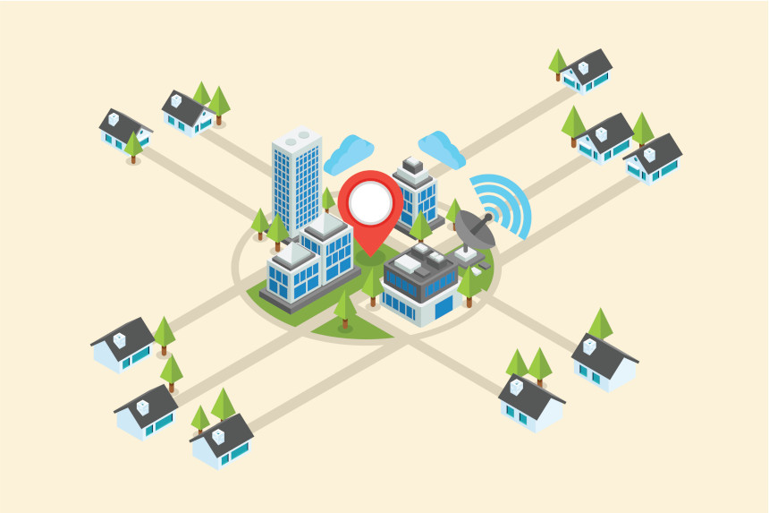

سالها پیش در سرزمین «بول‌بول‌زی» مردمان قبیله «بولی‌بولی» زندگی می‌کردن. اون‌هاتمام سرزمین رو زیر پا می‌ذاشتن تا از میوه‌های متنوع و گیاهان متنوع اون تغذیه کنن و گهگداری هم با شکاری که می‌کردن،‌نیازشون به گوشت رو برطرف می‌کردن. تا اینکه یک روز اون‌ها «کشاورزی» رو کشف کردن و متوجه شدن می‌تونن با سکونت در یک محل و پرورش دانه‌هایی مثل گندم و ذرت، غذای جمعیت بزرگتری رو تأمین کنن.مردم «بولی‌بولی» که رؤیای داشتن قبیله بزرگتری رو داشتن،‌ یک جلسه عمومی تشکیل دادن که توش همه اعضای قبیله حق رأی داشتن. تو اون جلسه تصمیم گرفتن سبک زندگی قبلی‌شون رو رها کنن،‌ خونه بسازن و با کشاورزی زندگیشون رو بگذرونن.

همه چیز خوب داشت پیش می‌رفت تا اینکه بعد از گذشت چند سال کشاورزی روی ناخوشش رو نشون داد. بعد از چند سال که کشاورزی رونق داشت،یک سال به خاطر حمله ملخ‌ها همه محصولات از بین رفت. اون سال مردم «بولی‌بولی» سختی زیادی کشیدن و تلفات زیادی دادن. در نتیجه یک جلسه عمومی گذاشتن و تصمیم گرفتن از این به بعد بخشی از محصول‌شون رو ذخیره کنن تا اگه دوباره قحطی شد،‌ بتونن از ذخیره غذایی‌شون استفاده کنن.

مردمان «بولی‌بولی» می‌دونستن که ساختن انبار و ذخیره مواد غذایی می‌تونه اون‌ها رو در خطر غارت همسایگان قرار بده؛ پس تصمیم گرفتن دور شهرشون دیوار بکشن. برای حفاظت از دیوار هم یک سیستم لشکری طراحی کردن که سربازهاش از بین جوانان خودشون انتخاب می‌شد و توسط «ریش سفید» رهبری می‌شد. هزینه این سیستم جدید می‌تونست با بخشی از محصولات که به عنوان مالیات پرداخت می‌شد تأمین بشه. اینجوری می‌تونستن امنیت غذایی و جانیشون رو تضمین کنن. قرار هم شد هروقت ریش سفید مرد، دوباره جلسه عمومی تشکیل بدن و ریش سفید بعدی رو انتخاب کنن.

یک روز «ریش سفید» دستور داد از این به بعد همه محصولات کشاورزی باید به انبار مرکزی شهر منتقل بشه، آشپزها با اون محصولات غذا می‌پزن و اون رو روزانه به مردم میرسونن. اینطوری نیازی نبود هیچ‌کس هیچ انباری توی خونش داشته باشه و «ریش سفید» هم مطمئن می‌شد که همه مردم غذای سالم و با کیفیت برای خوردن دارن و کسی شب رو گرسنه سر بر بالین نمی‌زاره. اکثر مردم «بولی‌بولی» از این پیشنهاد استقبال کردن،‌ تعداد کمی که «احساس استقلال» براشون مهمتر بود شکایت کردن،‌ اما ریش سفید تصیمش رو گرفته بود و اکثر مردم هم باهاش موافق بودن. چون این قانون زحمت آشپزی و نگرانی از نداشتن نون شب و … رو از دوششون برمی‌داشت.

از اونجایی که کشاورزی جواب داده بود و شهر روز به روز پیشرفت می‌کرد و جمعیتش بیشتر می‌شد، نیاز بود انبار شهر هم مدام بزرگ‌تر و کارآمدتر بشه.

اما بزرگ شدن انبار به تنهایی کافی نبود. هرچی شهر بزرگ‌تر می‌شد فاصله خونه‌ها از انبار بیشتر می‌شد و نتیجه رسوندن غذا با تاخیر روبرو می‌شد. و برای اینکه پیچیدگی اوضاع رو بهتر درک کنید،‌ خوبه بدونید که انبار تنها محل نگهداری غذا نبود. حالا دیگه نگهداری دارو‌ها،‌ اسلحه‌ها،‌اسباب‌بازی‌ها،‌و خیلی چیزهای دیگه در خونه ممنوع شده بود و همه این‌ها تو انبار مرکزی جمع می‌شد و هرموقع که شهروندی بهش احتیاج داشت،‌از انبار براش ارسال می‌شد.نتیجه اینکه همه ابعاد زندگی مردم «بولی‌بولی» با تاخیر همراه شده بود.

برای حل این مشکل، ریش سفید -از پول مالیات- پژوهشکده ای تاسیس کرد که کارش تحقیق
بر روی جاده‌ها و وسایل حمل و نقل فوق سریع‌ بود.

به مرور مساحت انبار از هر کشوری که شما می‌شناسین بزرگ‌تر شد و خبره ترین متخصصان انبارداری برای نظارت در اون مشغول به کار شدن. بهترین ارتش با پیشترفته ترین تجهیزات از اون محافظت می‌کردن و سریع‌ترین سیستم حمل و نقلی که تصورش رو هم نمی‌تونین بکنین در عرض چند دقیقه می‌تونستن هر محصولی رو به هر کجای این سرزمین پهناور برسونن.

مردم «بولی‌بولی» که از این سیستم مرکز محور که بهش «سموم» می‌گفتن – مخفف سیستم مفید و مرکزی - بسیار راضی بودن.

سموم، مدیریت غذا و دارو و تفریح و امنیت و جنبه‌های دیگه زندگیشون رو برعهده گرفته بود و اونها رو از این مسئولیت‌ها رها کرده بود.
راز موفقیت «سموم» سیستم حمل و نقل فوق پیشرفته و راه‌های فوق تکنولوژیکش بود که با سرعت خیلی خیلی زیاد می‌تونست مردم و محصولات رو جابجا کنه. این راه‌ها اینقدر خوب ساخته شده بودن که اگه مثلاً «باب» - یکی از اهالی بولی‌ بولی - می‌خواست به خونه آلیس – یکی دیگه از اهالی «بولی‌بولی» - بره هیچ‌وقت مستقیم نمی‌رفت،‌ چون خیلی دیرتر می‌رسید؛ به جاش از سیستم حمل و نقل سریع که همه خونه‌ها رو به انبار متصل کرده بود استفاده می‌کرد تا خودشو اول به انبار و از اونجا به خونه آلیس برسونه.

پژوهشکده‌های «سموم» تونسته بودن یک اینترنت بسیار سریع رو توسعه بدن. این اینترنت که سرورهاش توی انبار مرکزی نگه داری می‌شد، مرکز ثقل بسیاری از خدمات در شهر بود.

سیستم «جی پی اس» سموم به داوطلبان کمک می‌کرد همدیگه رو به راحتی پیدا کنن. یک «سیستم حسابداری آنلاین» در اختیار شهروندان گذاشته بود که می‌تونستن دخل و خرج‌هاشون رو توش مدیریت کنن؛ دوستی‌هاشون رو تو فضای مجازی ادامه بدن و حتی مدرسه‌های آنلاینی داشت که بچه‌های شهروندانی که دوست نداشتن بچه‌شون رو مدرسه بفرستن رو -با بهترین کیفیت- تو خونه آموزش می‌داد. و از همه بهتر،‌ برای هیچکدوم از این خدمات و صدها خدمات بی‌نظیر دیگه هیچ پولی به صورت مستقیم از شهروندان گرفته نمی‌شد.

اگه می‌خواین بدونین هزینه این خدمات از کجا تأمین می‌شد جوابش بسیار ساده است. از مالیاتی که شهروندان می‌دادن و درآمد ناشی از کسب و کارهای بسیار زیادی که «سموم» با همین مالیات‌ها به راه انداخته بود.

## ورود «سایفرپانک»‌ها

اما این همه ماجرا نبود. هرچقدر «سموم» قوی‌تر می‌شد، عده‌ای از شهروندان «بولی‌بولی» ناراضی تر می‌شدن. این‌ها همون‌هایی بودن که ترجیح می‌دادن «اختیار» و «مسئولیت» زندگیشون رو به ریش سفید نسپرن. اون‌ها از اینکه «سموم» می‌تونه به همه اطلاعات شهروندان دسترسی داشته باشه ناراضی بودن. این گروه که اسم خودشون رو «سایفر پانک» گذاشته بودن یک روز یک بیانیه شدیدالحن دادن و توش معایب سموم رو اینطور برشمردن:

> تو این سیستم مردم هیچ قدرتی ندارن و قدرتشون رو کاملاً به «مرکز» سپردن.
> چی می‌شه اگه ریش سفید تصمیم بگیره «جلسه عمومی» رو کنسل کنه و از این به بعد همه تصمیمات مهم «مثل انتخاب جانشین» رو خودش به تنهایی بگیره؟
> فکر می‌کنید مردم می‌تونن با نپرداختن مالیات ریش سفید رو مجبور کنن به خواسته‌هاشون تن در بده. ساده‌ترین پاسخ اینه که ریش سفید سیستم نظامی قوی‌ای داره که باعث می‌شه بتونه با ایجاد رعب و وحشت و مجازات مخالفان، رأی خودش رو به کرسی بنشونه. اما یک پاسخ جدیدتر اینه که اگه «بول‌بول‌زی» خیلی پیشرفته بشه، اون‌وقت احتمالاً اکثریت کارهای کشاورزی و … رو ربات‌ها میتونن انجام بدن. در همچون زمانی «ریش سفید» نه تنها از اعتصابات مردم آشفته نمی‌شه بلکه خوشحال هم می‌شه. چون بهش فرصتی میده که با مطرح کردن موضوع «مقطع بحرانی کنونی» همه مخالفان مکانیزاسیون رو ساکت کنه و همه شغل‌ها رو به ربات‌ها بسپاره.
> اگه ریش سفیدمالیات‌ها رو خیلی زیاد کنه و مردم رو تو فقر نگه داره - درحالیکه خودش و اطرافیانش تو ناز و نعمت زندگی می‌کنن- چه کاری از مردم برای تغییر وضع موجود برمیاد؟
> بهترین سناریوی این سیستم «دیکتاتور خیرخواهه» که قدرت تصمیم گیری علیه مردم رو داره، اما به دلایل اخلاقی این کار رو نمیکنه. اما سناریوی «دیکتاتور خیرخواه» هم بدون اشکال نیست. مثلا چی می‌شه اگه ریش سفید بعدی اینقدر اخلاقی نباشه؟
> چی میشه اگه دشمن با یک بمب خیلی قوی انبار مرکزی رو منهدم کنه؟ یا یک هکر حرفه‌ای بتونه سیستم مرکزی رو هک کنه و یک آتیش سوزی بزرگ توی انبار راه بندازه. فرض کنید این هکر بتونه سیستم‌های مهار آتیش رو از کار بندازه و درها رو هم قفل کنه. یادمون نره با تکنولوژیک تر شدن انبار، قدرت هکر‌ها برای آسیب زدن بهش بیشتر و بیشتر شده.

`برای خواندن مانیفست واقعی اون‌ها این مقاله رو بخونین:`
[مانیفست سایفرپانک](/مانیفست%20سایفرپانک)

احتمالاً انتظار دارید بعد از انتشار این بیانیه توسط « سایفرپانک‌ها » بلوای زیادی برپا بشه،‌ اما راستش همچین خبری نشد و مسأله دو تا دلیل داشت:

- اول اینکه تمام رسانه‌های مهم و تاثیرگذار در اختیار «سموم» بود و طبیعتاً اون‌ها اجازه نمی‌دادن کسی علیه‌شون مقاله بنویسه
- دوم اینکه دنیایی که «سایفرپانک»‌ها تصویر می‌کردن یک دنیای خیالی در آینده بود،‌ در حالیکه منافعی که «سموم» به شهروندان می‌داد حقیقی و حاضر بود.

سایفرپانک‌ها از اینکه صداشون به اندازه کافی شنیده نمی‌شد دلخور بودن اما دست از تلاش برنمی‌داشتن. تلاش اون‌ها دو جبهه داشت:

- اول آگاهی هرچه بیشتر مردم از خطراتی که انتظارشون رو می‌کشه
- دوم طراحی و ساخت یک سیستم «غیرمتمرکز» که بتونه از پس مدیریت شهری به بزرگی بولی‌بول‌زی بربیاد.

چندسالی به همین منوال گذشت تا اینکه ریش سفید از دنیا رفت. بعد از مردن ریش سفید اوضاع سیاسی شهر شدیداً به هم ریخت. فراموش نکنید شهر فوق پیشرفته «بول‌بول‌زی» با درآمد مالیاتی بسیار زیادی که شهروندان می‌پرداختن اداره می‌شد و اینکه چه کسی جانشین «ریش سفید» بشه تصمیم خیلی مهمی شده بود.

خیلی‌ها سعی می‌کردن کسی از خانواده و فامیل خودشون رو به کرسی بنشونن، چون این کار منافع زیادی می‌تونست داشته باشه. خیلی‌های دیگه به دنبال منافع شخصی نبودن اما نمی‌خواستن کسی از خانواده‌هایی که باهاشون رابطه خوبی نداشتن سر کار بیاد،‌ چون می‌ترسیدن از قدرت بی کرانشون علیه منافع این‌ها استفاده کنن. گروه سومی هم بودن که کاری به منافع شخصی نداشتن، اونها نگران جانشینی بودن که به خاطر منافع شخصی عده‌ای سر کار بیاد و کاری به مصلحت عمومی نداشته.

این اختلافات برای مردم «بولی‌بولی» گرون تموم شد. مردم این شهر که سال‌ها بود هیچ پروژه مشترکی نداشتن و هیچ نوع همکاری ای رو تمرین نکرده بودن نمی‌تونستن راه حلی برای این مشکل پیدا کنن. این بود که کم کم درگیری‌ها به زد و خورد کشید و خطر جنگ داخلی به وجود اومد.

ارتش برای جلوگیری از جنگ کودتا کرد و اداره «سموم» رو به دست گرفت و در اولین قدم هر اجتماعی رو ممنوع کرد. ارتش برای ساکت کردن مردم غذا و دارو رو سهمیه بندی کرد و اعلام کرد هرکسی بر خلاف نظم موجود عملی انجام بده -بسته به شدت مخالفتش می‌تونه، به زندان بیفته یا سهمیه غذاش رو از دست بده. اطلاعاتی که توی شبکه‌های اجتماعی ذخیره شده بود، به ارتش این امکان رو می‌داد که به راحتی حلقه‌های دوستی رو شناسایی کنه و زیر نظر بگیره. بیگ دیتا و هوش مصنوعی که «سموم» تو این سالها برای ارائه خدمات هوشمندتر به شهروندان توسعه داده بود، حالا علیه اون‌ها استفاده می‌شد. تو این مرحله دیگه چاره‌ای برای مردم نمونده بود جز اینکه به خواسته‌های ارتش که روز به روز سخت گیرانه تر می‌شد تن در بدن.

به مرور اوضاع سیاسی آروم شد اما سهمیه بندی‌ها هیچ‌وقت حذف نشد. مردم شهر با پیشرفته‌ترین تکنولوژی‌ها علامت گذاری شدن و از سیستم GPS سموم برای کنترل رفت و آمد‌هاشون استفاده می‌شد. ارتش که حالا «عمو جان» رو به کرسی ریاست شهر نشونده بود برای همه ساعت کار اجباری با کمترین میزان حقوق تعیین کرد و حقوق ارتشی‌ها رو چندین برابر کرد. البته از حق نگذریم که بودجه زیادی برای تحقیق و توسعه ربات‌های کارگر تصویب کرد تا به مرور مردم رو از فداکاری «کار کردن» آزاد کنه و اجازه بده افراد به زندگی سابقشون برگردن.

سخت ترین نظارت‌های «عمو جان» روی سیستم پولی بود. اون می‌دونست هیچ همکاری گسترده ای بدون استفاده از پول شکل نمی‌گیره. پس با کنترل و نظارت تولید و توزیع پول در جامعه از طرفی می‌تونست هر فعالیت مخالفی رو شناسایی و خنثی کنه و از طرف دیگه ثروت زیاد خودش و اطرافیانش رو تضمین کنه. این «نظام پولی متمرکز» در کنار «سیستم حسابداری متمرکز» آنلاینی که شهروندان ازش استفاده می‌کردن و کنترلش کاملاً در اختیار «عمو جان» بود،‌ قدرت اون رو برای سلطه بر مردم بی‌نهایت می‌کرد.

تو این شرایط گروه‌های مخالف زیادی به وجود اومدن و به مبارزه فکری عملی علیه ارتش پرداختن. یکی از مهمترین این گروه‌ها همون «سایفر پانک»‌ها بودن که قبلاً در موردشون بهتون گفته بودم. سایفر پانک‌ها مبارزاتشون رو افزایش دادن و بالاخره توسط یکی از اعضاشون یک «واحد پولی غیرمتمرکز» ساختن که «بیت کوین» نام داشت که بر بستر یک شبکه غیرمتمرکز به نام **بلاکچین** اجرا می‌شد.

اهمیت بیتکوین در این بود که مزیت‌های پول قبلی رو این بار به صورت «غیر متمرکز» ایجاد می‌کرد. به این شکل که این پول توسط جامعه و به صورت پراکنده به وجود می‌اومد. این پول که غیر قابل توقیف شدن بود می‌تونست به راحتی از هرکسی به دیگری منتقل بشه و «سموم» هم نمی‌تونست در مقابلش هیچ کاری بکنه، البته به جز بازداشت همه افرادی که این **بلاکچین** رو روی اینترنت نگهداری می‌کردن. راه دیگه مقابله با اون این بود که کل اینترنت رو قطع کنن ولی با این کار تمام امکانات فوق پیشرفته ای که داشتن رو از دست می‌دادن.

اتاق فکر «عمو جان» طرح هوشمندانه دیگه ای ریخت. تحلیل‌های اون‌ها مشخص کرد که اگه ۵۱ درصد نود‌هایی که شبکه **بلاکچین** رو نگهداری میکنن مال خودشون بکنن اونوقت می‌تونن شبکه رو از کار بندازن. درنتیجه امکاناتشون رو به کار بستن تا یک حمله ۵۱ درصد رو به شبکه تدارک ببینن اما مردم «بولی‌بولی» که اهمیت **بلاکچین** رو فهمیده بودن هم به **بلاکچین** می‌اومدن. هرچی تعداد نودهای کنترل شده توسط «عمو جان» روی **بلاکچین** بیشتر می‌شد مردم هم نود‌های بیشتری می‌ساختن و اجازه نمیدادن نود‌های «عمو جان» به ۵۱ درصد برسه.

چندی از این رقابت نگذشته بود که مردم «بولی‌بولی» ابتکار عمل بیشتری به خرج دادن. اون‌ها **بلاکچین**‌ها متنوعی رو با قابلیت‌های متنوع ساختن،‌بعضی‌هاشون در مقابل حمله ۵۱ درصد ایمن بود، بعضیاشون به مردم امکان انتخابات آزاد می‌داد،‌بعضیاشون هم به مردم امکان می‌داد همون خدماتی رو که توی اینترنت سموم دریافت می‌کردن،‌ اینبار روی یک «شبکه غیر متمرکز» دریافت کنن. همه این محصولات با خصوصیات متفاوت دو خصیصه مشترک داشت:‌ «توسط مردم اداره می‌شد و قدرت رو در اختیار مردم می‌گذاشت»
