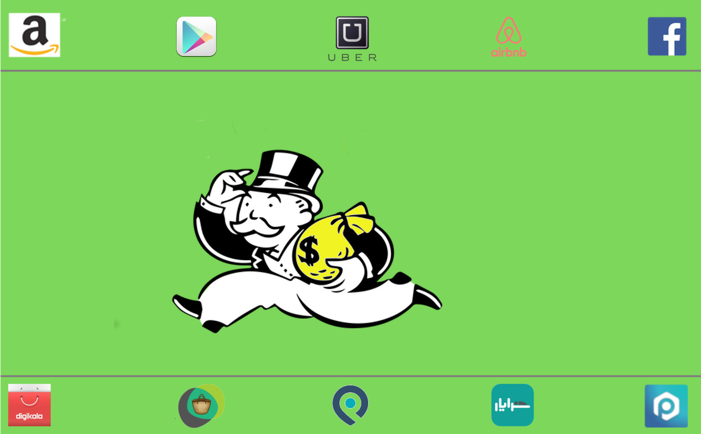
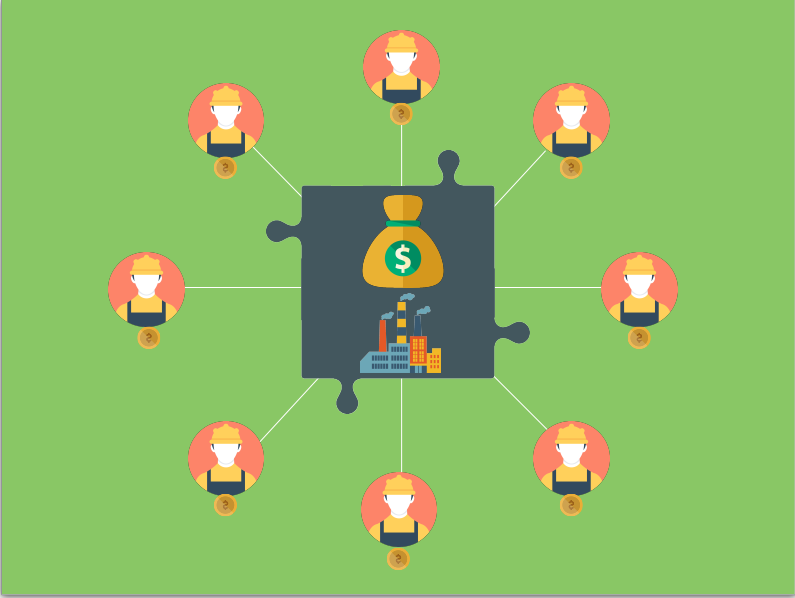
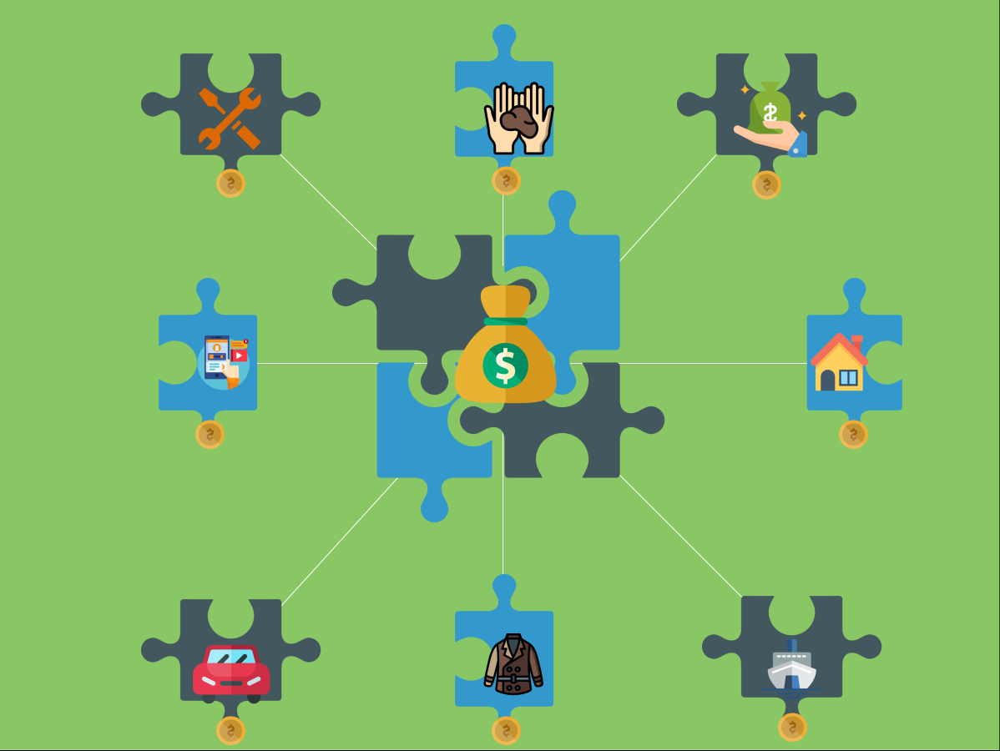
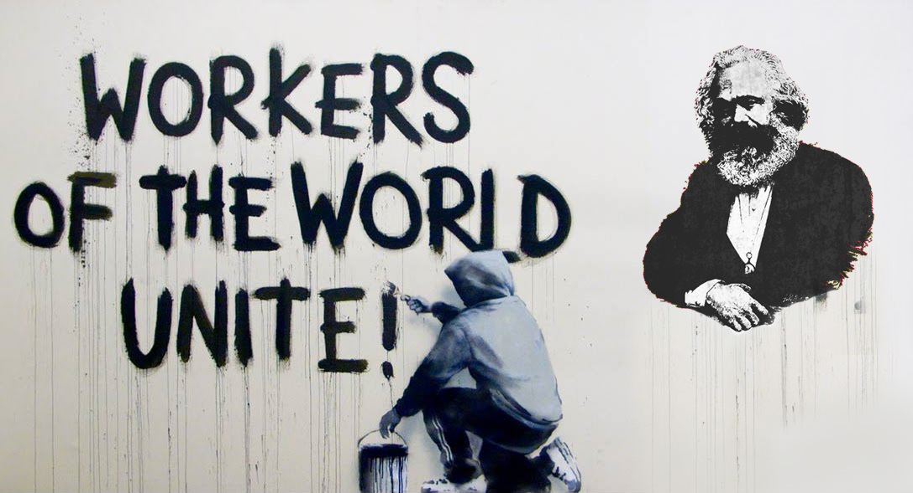

## عصر اعتماد

در بیشتر تاریخ بشر، معاملات انسان‌ها به صورت نفر به نفر (peer to peer) انجام می‌شد. فعالیت‌هایی مثل پول قرض دادن، امانت دادن اجناس و حتی در اختیار گذاشتن مهارت‌ها فقط زمانی اتفاق می‌افتاد که دوستی و اعتماد بین افراد وجود داشت. به عبارت دیگه آدما وقتی اجناس یا مهارت‌هاشون رو به هم میدادن که همدیگه رو از قبل میشناختن و باهم در تماس بودن.

## عصر تولید انبوه

بعد از انقلاب صنعتی و به وجود آمدن کمپانی‌ها، معامله بر مبنای شناخت به مرور کمرنگ تر شد. در طی دو قرن گذشته «تولید و توزیع انبوه» بود که اقتصاد ما رو شکل می‌داد. چشم انداز این اقتصاد،‌ جهانی پر از فراوانی منابع اقتصادی،‌ فکری و فیزیکی بود که توسط تولیدکننده‌ها و سرویس دهنده‌های «متمرکز» ایجاد می‌شد. این واحد‌های اقتصادی متمرکز می‌تونستن مثل بانک‌ها و دولت‌ها صاحبان پول باشند یا مثل کارخانجات صاحبان کالاهای مصرفی باشن یا مثل هتل‌ها صاحبان کالاهای خدماتی.
الگویی که تو همه این اشکال مشترکه «ارزشیه که در نقطه‌ای به وجود میاد و توسط مصرف کنندگان انبوه استفاده میشه»
منافعی که این روش برای تولیدکنندگان به وجود می‌آورد غیر قابل تصور بود. همین منافع بود که اون‌ها رو وامی‌داشت کارخانجات بزرگ‌تر و بزرگ‌تری بسازن تا تولید رو انبوه و انبوه تر کنن. شرکت‌ها و کارخانجات عظیم و چند ملیتی وجه مشخصه اقتصاد این دوران هستن.
مثلاً اگه تو این دوره می‌خواستید هزاران توریست رو میزبانی کنید باید سرمایه‌گذاری عظیمی میکردید و ده‌ها هتل بزرگ و مجهز راه می‌انداختید و صدها نفر رو به استخدام در می‌آوردید و اگه میتونستید این حجم نیرو و سرمایه رو خوب مدیریت کنید، به احتمال زیاد اینقدر قوی می‌شدید که هیچ سرمایه گذار خرده پایی نتونه بازارتون رو تهدید کنه.
یا اگه میخواستید میلیون‌ها مسافر رو جابجا کنید باید به همون شکل برای خرید هزاران خودرو سرمایه‌گذاری می‌کردید و به همون شکل نتیجه سرمایه‌گذاری هنگفتتون رو میگرفتید.
اگه بخوایم این دوره رو در یک جمله خلاصه کنیم، میتونیم بگیم: «خیلی سرمایه بذار تا خیلی سود کنی»

بزرگترین منتقد این عصر «کارل مارکس» بود که دنیا رو متوجه برتری «سرمایه» بر «کار» کرد. مارکس متوجه شد که تو همچین سیستمی منافع ناشی از تولید محصول جدید به کسی میرسه که سرمایه رو آورده و کسی که نیروی کار و تخصصش رو آورده منافع ناچیزی می‌بره.
مارکس یک مبارزه فکری بزرگ رو علیه این بی‌عدالتی به راه انداخت و اعلام کرد:

> چون «کار اصلی» رو کارگران کارخونه‌ها انجام میدن و «نفع اصلی» رو کسی میبره که «صاحب ابزار تولید» هست،‌ پس این کارگران هستند که باید «صاحبان ابزار تولید» باشن و اگه غیر از این باشه،‌ سرمایه داران همه سود رو برای خودشون برمیدارن و به کارگران در حدی حقوق میدن که از گرسنگی نمیرن.

تلاش‌های مارکس و پیروانش منافع بسیاری برای کارگران داشت. اتحادیه‌های کارگری،‌ قوانین استخدام و اخراج، محدودیت ساعت کار، تعطیلات آخر هفته و خیلی از قوانینی که امروزه از کارگران حمایت میکنن، نتیجه تلاش و مبارزه اون دوران کارگران جهان هستن.

## عصر پلتفرم

توسعه اینترنت در دهه نود همه چیز رو تغییر داد و برای اولین بار فرصت رشد اقتصاد نفر به نفر «p2p» رو به وجود آورد؛ اقتصادی که در اون انبوهی از معاملات به صورت فرد به فرد انجام میشه. درچنین تجارتی به جای اینکه یک عرضه کننده،‌ محصولات انبوه خود رو به انبوه مشتریان برسونه، «انبوه عرضه کنندگان» محصولات خودشون رو به «انبوه متقاضیان» میرسونن. البته هنوز این «عرضه کنندگان» و «صاحبان تقاضا» هنوز برای اینکه همدیگه رو پیدا کنن به یک نقطه اتصال احتیاج داشتن. سرویسی که لیستی از هردو طرف تهیه کنه و بتونه اون‌ها رو به هم متصل کنه.
وب سرویس‌هایی مثل eBay و Craigslist پیشگامان این نوع از تجارت در جهان بودن. در ایران «دیوار» و «شیپور» نام‌آشناترین برند‌ها در این زمینه هستن.

در طی دهه گذشته «تکنولوژی‌های پیشرفته موبایلی» و «سرویس‌های مکان محور» دست به دست هم دادن تا مفهوم «اقتصاد اشتراکی» یا (sharing economy) به وجود بیاد و سهم بزرگی از اقتصاد و تجارت پلتفرم‌ها رو به خودش اختصاص بده.

حالا اگه خیلی شوخ‌طبع باشیم می‌تونیم بگیم رؤیای کارل مارکس برآورده شد. حالا دیگه کارگران، خودشون صاحبان ابزار بودن. مثلاً کسی که تو «اسنپ» کار میکنه خودش ماشینش رو خریده و کارگر کمپانی به حساب نمیاد. AirBnb هیچ سرمایه ای برای خرید یا اجاره اتاق‌ها نمی‌پردازه و صاحبان اون‌ها همون کسایی هستن که اتاق‌ها رو اجاره میدن.

اما همونطور که می‌بینید، نه تنها اوضاع برای کارگران بهتر نشده بلکه بدتر هم شده! در پارادایم قبلی لااقل سرمایه گذاران سرمایه شخصیشون رو وارد میدون میکردن و روش ریسک میکردن تا از منافعش بهره ببرن. از طرف دیگه به خاطر نتایج مبارزات کارگری و به وجود اومدن اتحادیه‌ها و قوانین حمایت از کارگران، سرمایه گذاران نمی‌تونستن هرجور که میخوان با کارگرها رفتار کنن و هر قانونی که میخوان برای ارتباط با اون‌ها وضع کنن؛ مجبور بودن اون‌ها رو بیمه کنن، ساعت کار قانونیشون رو رعایت کنن، براشون حقوق مشخصی معین کنن که فارغ از اوضاع بازار به اون‌ها پرداخت بشه و نسبت به اخراجشون پاسخگو باشن. اما کارگرانی که برای پلتفرم‌ها کار میکنن مجبورن سرمایه خودشون رو بذارن و هیچکدوم از قوانین حمایتی بالا رو هم ندارن.

بذارید با یک مثال از «کافه بازار» مشکل رو دقیق‌تر توضیح بدم.
هرکسی که گوشی اندرویدی داره – و احتمالاً هرکسی که نداره- اسم کافه بازار رو شنیده. کافه بازار پلتفرمیه که برنامه نویس‌های موبایل اندرویدی، اَپ‌هاشون رو توش ثبت میکنن و متقاضیان این اپ‌ها میتونن اون اپ‌ها رو تهیه کنن.

این برنامه نویس‌ها هیچ بیمه ای ندارن،‌ عموما بیشتر از هفته‌ای ۴۰ ساعت کار می‌کنن و کافه بازار هروقت صلاح بدونه بر اساس قوانین داخلی خودش و تشخیص نیروهای خودش میتونه به صورت یکطرفه باهاشون قطع همکاری کنه و اپ‌هاشون رو از پلتفرمش بیرون بندازه. اگه بعد از تمام این تلاش‌ها اپلیکیشن اون‌ها ضرر بده و سودی نکنه کافه بازار هزینه ای بابت این تلاش هدر رفته نمی‌پردازه ولی اگه تلاششون به ثمر بشینه تنها ۶۰ درصد فروششون به حسابشون واریز می‌شه!
۱۰ درصد پول پرداختی خریداران برای مالیات کسر میشه،‌۳۰ درصدش رو کافه بازار برمی‌داره و ۶۰ درصد باقیمونده به گروهی که اپ رو تولید کردن میرسه که بین خودشون تقسیم کنن.

> مثلاً اگه یک تیم ۲ نفره یک سال وقت بذاره و یک اپلیکیشن عالی تولید کنه و این اپش بتونه تو کافه بازار ۱۰۰ میلیون تومان فروش کنه سهم کافه بازار دقیقاً به اندازه سهم هرکدوم از اعضای تیمیه که یک سال روی پروژشون کار کردن و از اونجایی که اپی که بتونه همچین فروش فوق‌العاده‌ای داشته باشه احتمالاً باید تیم بزرگتری داشته باشه، میتونیم بگیم سودی که کافه بازار از تولید اپ‌ها برمی‌داره بیشتر از سودیه که اعضای اون تیم برمیدارن.

پس می‌بینیم به وجود اومدن پلتفرم‌ها بیشتر از اینکه به نفع عموم مردم باشه به نفع «گروه جدید کارآفرینان» بود که میتونستن با استفاده از «سرمایه‌های مردم» کارآفرینان سنتی و سرمایه داران قدیمی رو به چالش بکشن.

مثلاً AirBnb از ظرفیت اتاق‌های خالی مردم استفاده کرد تا هتلدارهای سنتی رو به چالش بکشه. Uber و Lyft – و مدل‌های وطنیشون- از ماشین‌های مردم برای به چالش کشیدن تاکسیرانی سنتی استفاده کردن. GooglePlay و «کافه بازار» بر تلاش و تخصص برنامه نویس‌ها سوارن و کمپانی‌هایی دیگه مثل Etsy و ‌Binance و پلتفرم‌های نامدار وطنی مثل «دیوار» و «شیپور» و «بامیلو» و همه و همه به همین شکل از سرمایه‌های جامعه برای سودآوری شخصی استفاده می‌کنن.
جالبه بدونین پتانسیل این اقتصاد ۲ تریلیون دلار برآورد میشه،‌ در حالی که در حال حاضر فقط ۲۵۰ میلیارد دلارش فعال شده!

شاید زمان اون رسیده که یک بار دیگه مارکس فقید از قبر خودش بلند شه و فریاد بزنه. فریادی که این بار مخاطبش به جای کارگران، کاربران هستن و اون‌ها رو به اتحاد علیه پلتفرم‌ها تشویق کنه. اتحادی که این بار بر پایه حمایت «اتحادیه‌های کارگری» و احتمالا برپایه **بلاکچین** و پلتفرم های مبتنی بر بلاکچین خواهد بود.

با توجه به مطالب بالا امیدوارم با من موافق باشین که دنیای امروز نیازمند ساختارهای نیرومندیه که دنیای عادلانه تری رو برامون به ارمغان بیارن. در چنین دنیایی، سود هرکس از محصولی که تولید شده به اندازه ارزشی است که به وجود آورده و افراد یا شرکت‌ها نمیتونن با متمرکز کردن ارزشی که عموم مردم در به وجود‌ آوردنش سهیم هستن – و در اختیار گرفتنش- سودهای نامتعارف ببرن.
اگر «امیدواری» بالا رو با من شریک هستین،‌ احتمالا به اندازه من از
**بلاکچین**
و دنیایی که می‌تونه برامون بسازه استقبال می‌کنین. برای آشنایی بیشتر با طرز کار **بلاکچین** می‌تونین مقاله

`برای آشنایی بیشتر با طرز کار **بلاکچین** می‌تونین مقاله:`
[آموزش بلاکچین با کارت‌های پوکمون](/آموزش%20بلاکچین%20با%20کارت‌های%20پوکمون)
رو بخونین
