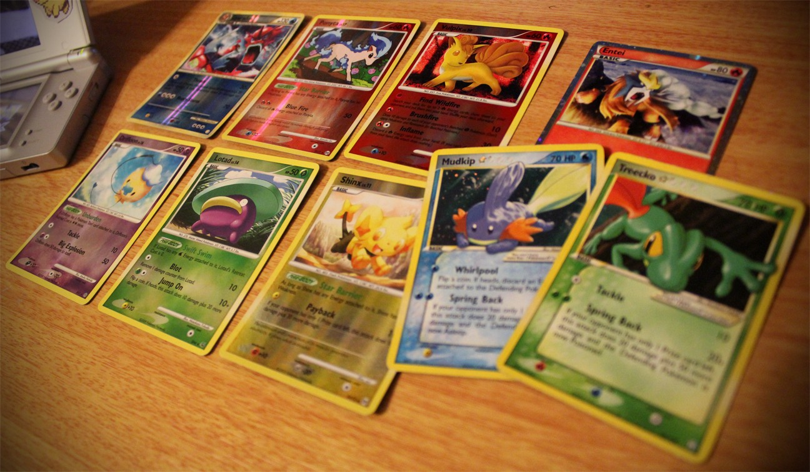

تصور کنید که ما دو تا بچه مدرسه ای هستیم که در مدرسه روبروی هم نشستیم و داریم کارت های پوکمونمون رو باهم معامله می‌کنیم و تصمیم می‌گیریم دوتا کارت پوکمونمون که تقریباً هم ارزش هستن رو باهم عوض کنیم. هیچ دوز و کلکی در کار نیست. هردوی ما میخوایم این کار رو صادقانه انجام بدیم. پس من کارتم رو به شما میدم و شما هم کارتتون رو به من.

به عنوان بچه‌های ده ساله، بدون اینکه نیازی به نظارت معلم داشته باشیم می‌تونیم این مبادله رو انجام بدیم.این کار خیلی راحته، چون این کارت ها فیزیکی هستن وصاحبانشون کاملاً مشخص. کارت مال کیه؟ کسی که اونو تو جیبش داره. به همین سادگی!

اما راستش این این روش فقط درباره «اشیای فیزیکی» ساده و کارآمد به نظر میاد. چی میشه اگه ما بخوایم کارت های دیجیتالی پوکمونمون رو باهم عوض کنیم؟

فرض کنیم من یک کارت دیجیتالی بسیار ارزشمند پوکمون دارم که فقط یک نسخه از اون وجود داره و شما می‌خواین اون رو از من بخرین. شما چطور می‌تونین مطمئن بشین که من قبل از ارسال اون کارت برای شما، یک کپی ازش برای خودم برنداشتم؟ اگه من ۱۰۰۰ تا از اون کارت کپی کرده باشم و اونها رو به هزار نفر فروخته باشم،‌دیگه اون کارت ها ارزشی که شما فکر میکنین رو نداره. درسته؟
متأسفانه باید بگم هیچ راهی وجود نداره که شما از این موضوع مطمئن بشین.

این مشکل یک اسم داره : **double-spending**. با یک آشنایی ساده به زبان بولی‌بولیایی میشه فهمید معنای این عبارت چیزی شبیه «خرج کردن دوباره» میشه. اما من تو این مقاله ترجیح میدم از همون عبارت double-spending استفاده کنم تا با اصطلاحات حوزه **بلاکچین** بیشتر آشنا بشین.

برای حل این مشکل می‌تونیم از یک **ledger** استفاده کنیم – معنای فارسیش میشه «دفتر کل»- «لجر» رو یک دفتر کل درنظر بگیرین که لیست همه اموال و دارایی‌ها رو توش می‌نویسیم.

تو مثال بالا این دفتر کل رو مرکز کمپانی «نینتندو» نگه می‌داره. اونه که تعیین می‌کنه هرکدوم از کارت ها مال کیه و طبیعتاً «نینتندو» هست که می‌تونه مالکیت این کارت ها رو عوض کنه. اینجوری دیگه مشکل **double-spending** پیش نمیاد.
اما خب این رویکرد یک مشکلی داره و این هم اینه که مجبور شدیم شخص ثالثی(third party) رو به عنوان «واسطه» وارد ماجرا کنیم.

حالا وضعیت با وضعیت مدرسه ای ما فرق کرد! حالا ما باید به یک نفر سوم اعتماد کنیم و مطمئن باشیم که اون «دفتر کل» رو دستکاری نمی‌کنه. اما اگه «نینتندو» تصمیم بگیره «دفتر کل» رو به نفع خودش تغییر بده چه کاری از ما برمیاد؟ اگه اون تو حفظ امنیت سرورهاش خوب عمل نکنه و داده های ما توسط یک هکر از بین بره چی؟

ما هیچ وقت نمی‌تونیم ۱۰۰ درصد مطمئن باشیم که همچین اتفاقایی نمی‌افتن. پس بیاید به قضیه جور دیگه ای نگاه کنیم. چی میشه اگه به جای اینکه ما لجرمون رو توی مرکز «سموم» نگه داریم، یک کپی ازش رو به هرکدوم از معامله گران پوکمون بدیم؟

هزاران هزار پوکمون‌باز در سراسر دنیا وجود داره. می‌تونیم بگیم هرکسی یک کپی از لجر – یا همون دفتر کل- رو نگه داره و هروقت که مبادله ای انجام شد، ما به همه خبر بدیم تا تغییر مالکیت کارت‌ها رو توی دفتر کل‌شون وارد کنن.

برگردیم به مبادله خودمون. توی لجرها ثبت شده که من فقط یه دونه از این کارت دارم و بعد از معامله،‌ اون دارایی من رو به شما منتقل می‌کنن. اینجوری من دیگه نمی‌تونم کارتم رو دوبار بفروشم.

ممکنه فکر کنین که خبر دادن این معامله به همه پوکمون‌بازهای جهان کار پیچیده ایه ، اما اینطور در نظر بگیرین که ما مثلا ۱۰۰۰ کامپیوتر در سراسر جهان داریم که سیستم معاملات کارت های پوکمونمون رو نگهداری می کنن. بیاین اسم این کامپیوترها رو نود (node) بزاریم.

همه نود ها یک کپی از داده‌ها رو روی لجر خودشون و همشون می‌تونن از طریق اینترنت باهمدیگه در ارتباط باشن. هدف همه نودها هم اینه که به صورت مستقل هر معامله کارت پوکمونی رو ثبت کنن.این نودها باید درباره تراکنش ها باهمدیگه توافق داشته باشن. تراکنش ها می‌تونن جابجایی کارت ها یا به وجود اومدن کارت جدید باشن.

سیستم کار به این شکل می‌شه که اگه من یک معامله ای با شما بکنم، این اطلاعات تراکنش به یک «استخر موقت تراکنش های تأیید نشده» میره. هر چند وقت یک بار (مثلاً هر ده دقیقه) همه این تراکنش ها به‌ گروه خاصی از نودها ارسال می‌شن.

به این نودهای خاص ماینر (به معنی معدنچی) می‌گیم. کار ماینر ها اینه که تمام تراکنش هایی که توی ده دقیقه انجام می‌شه رو توی یک برگه (بلوک) یادداشت کنن و به همه بگن که این بلوک رو به انتهای دفترکل اضافه کنیم. اینجوری همه ما تاریخ معاملات کارت های پوکمون رو در یک زنجیره ای از بلوک ها – که بهش **بلاکچین**- می‌گیم در اختیار داریم .

خب حالا اگه ماینرهای ما انگیزه‌ای برای دسته بندی و ارسال این تراکنش ها نداشته باشن چی میشه؟ اون وقت کل سیستم ما می‌خوابه و تراکنش ها تأیید و ثبت نشده باقی می‌مونن. برای اینکه این مشکل پیش نیاد، ما به ماینرها یک انگیزه جذاب می‌دیم. بهشون میگیم که به ازای هر بلوکی که تأیید کنن، چند تا کارت پوکمون جایزه می‌گیرن. احتمالاً اگه این کار رو بکنیم نه تنها بلوک‌هامون تأیید نشده رها نمی‌شن، بلکه برای تأیید اونها بین ماینرها رقابت هم شکل میگیره.

اما حالا مشکل دیگه ای داریم. اگه جایزه ما اینقدر جذاب باشه که همه بخوان بلوک‌ها رو تأیید کنن چیکار کنیم؟ ما تنها به یک ماینر احتیاج داریم که این بلوک جدید رو بسازه و آدرسش رو برای همه ارسال کنه تا همه بتونن به انتهای زنجیره بلوکشون اضافه کنن. اگه همه بخوان این وسط بلوک‌‌سازی کنن، اونوقت به جای یک بلوک چندین بلوک – در آدرس‌های مختلف- ساخته می‌شه که محتواشون عین همدیگست و ما نمیدونیم کدومشون رو به زنجیرمون اضافه کنیم و پاداش رو به ماینرش بدیم!

خب همه چی چاره داره. برای حل این مشکل هم می‌تونیم یک محاسبات خیلی بزرگ پیچیده به کامپیوتر ماینرها بدیم که برای حلش احتیاج به اعداد تصادفی و محاسبات ریاضی داشته باشن. به این صورت که ماینر یک عدد تصادفی رو توی فرمول می‌ذاره. اگه خروجی به دست اومده همون چیزی شد که انتظار داشتیم – که احتمالش کمه- ماینر به همه اعلام می‌کنه «من جواب رو پیدا کردم» و اون عدد رو برای همه می‌فرسته. اگه بقیه هم وقتی عدد رو توی فرمول گذاشتن نتیجه درست در اومد می‌فهن که ماینرمون دروغ نگفته و واقعاً تلاش کرده و معدله رو حل کرده. در نتیجه جایزشو می‌دیم، بلوکشو به انتهای زنجیر اضافه می‌کنیم و به بقیه میگیم ۱۰ دقیقه صبر کنن تا بلوک بعدی آماده بشه. شاید اونجا شانس باهاشون بیشتر یار باشه!

اگه خوب دقت کرده باشین می‌بینین که تو این سیستم هیچ نودی به نود دیگه چشم بسته اعتماد نمی‌کنه. بلکه حتماً خودش عدد اعلام شده «ماینر خوش شانس» رو امتحان می‌کنه و مطمئن میشه دوز و کلکی تو کارش نیست. این روشیه که کل شبکه به اجماع (consensus) می‌رسه.

حالا یه مشکل دیگه. فرض کنین یک نفر آدم متقلب می‌خواد مرتکب double-Spending یا همون «دوبار خرج کردن» بشه و کارتش رو همزمان به شما و یک نفر دیگه واگذار کنه.
اینجا آدم متقلب دو تا تراکنش رو به «استخر موقت تراکنش های تأیید نشده» می‌فرسته تا تاییدشون کنه. شبکه اجازه نمیده هر دو تراکنش ثبت بشه و تنها یکیش رو تأیید می‌کنه. در نتیجه نقشه فرد متقلب نقش بر آب می‌شه، اماممکنه یک اتفاق بد برای شما بیفته! اون چیه؟

اینکه تراکنشی که فروش کارت به فرد دیگری غیر از شما رو نشون میده، قبل از تراکنش شما صادر شده باشه و درنتیجه تراکنش شما باطل بشه. اینجا اگه شما روی اون تراکنش حساب کرده باشین دستتون تو پوست گردو می‌مونه – مثلاً فرض کنین در ازای این کارت پوکمون بهش یک پولی دادین و اون هم پولش رو گرفته و رفته!

چطور می‌تونین از این مشکل جلوگیری کنین؟ راهش اینه که بعد از انجام تراکنش حداقل ۱۰ دقیقه صبر کنین تا توی **بلاکچین** ثبت بشه. بعد از اینکه مطمئن شدین تراکنش شما توی **بلاکچین** ثبت شده،‌ حالا میتونین پول رو بهش پرداخت کنین.

حالا وقتشه آخرین راز **بلاکچین** رو هم بهتون بگم. همونجور که احتمالاً فهمیدین بلوک های حاوی تراکنش های ما توی **بلاکچین** به صورت خطی و بر اساس زمان پشت همدیگه ثبت میشن. - اصلاً به همین دلیله که به این شبکه، زنجیره بلوک یا **بلاکچین** میگیم- چی میشه اگه بخوایم مثلاً بلوکی که ۹۰ دقیقه پیش ثبت شده رو تغییر بدیم و اطلاعاتش رو عوض کنیم؟

این مسأله جواب ساده داره و جواب طولانی. برای اینکه جواب طولانیش رو بدم باید براتون از کریپتوگرافی و هش و چیزهای دیگه ای بگم که فعلاً ضرورتی نداره اما جواب کوتاهش اینه که نمیشه.

هر بلوکی که توی **بلاکچین** ثبت می‌کنیم یک آدرسی داره که این آدرس توی بلوک بعدی دخیره شده. حالا اگه بخوایم اطلاعات یه بلوک رو عوض کنیم آدرس اون هم تغییر می‌کنه – چراش برمیگرده به همون جواب طولانی- و اونوقت بلوک بعدیش دیگه نمی‌تونه پیداش کنه. پس مجبور می‌شیم محتوای بلوک بعدی رو هم تغییر بدیم و آدرس جدید رو توش بنویسیم. اما خب با این کار حالا آدرس این‌یکی بلوک عوض میشه و بلوک بعدیش دیگه نمی‌تونه پیداش کنه.

درکل اینجور براتون بگم که اگه بخوایم محتوای یک بلوک تو **بلاکچین** رو عوض کنیم، تمام بلوک های بعدی به هم می‌ریزن و باطل می‌شن.
نتیجه‌ای که می‌گیریم اینه که داده‌ای که توی **بلاکچین** ذخیره می‌شه غیرقابل تغییره و نمیشه عوضش کرد.

خب،‌ به همین سادگی – و البته با کلی پیچیدگی فنی- ما یک سیستم شفاف،‌امن ،غیرمتمرکز و غیرقابل تغییر برای معاملات کارت هامون ساختیم.
این سیستم شفافه چون تمام تراکنش ها توی لجر همه نودها ثبت می‌شه و درنتیجه همه می‌تونن اون رو ببینن. امنه چون برخلاف سیستم‌های متمرکز که همه داده هامون توی یک سرور ذخیره شده و اگه کسی بتونه اون رو هک کنه، کل داده‌ها فنا رفته، اینجا داده‌ها رو توی هزاران نود ذخیره می‌کنیم و هک همزمان هزاران نود خیلی خیلی سخت تره. غیرمتمرکز بودنش که واضحه و درباره غیرقابل تغییر بودنش هم براتون توضیح دادم.

هرچند این مثال بسیار ساده بود اما امیدوارم تونسته باشه بک درک کلی به شما بده که تکنولوژی **بلاکچین** چطور کار می‌کنه . تکنولوژی ای که سازنده‌ رمزارزهای متنوعی مثل بیت کوینه و می‌تونه بدون دخالت و نظارت واسطه ها و آقابالاسرها دارایی‌های مارو مدیریت کنه!

(ترجمه نسبتا آزاد از این مقاله که نشون میده
[بلاکچین چطور کار می‌کنه](https://medium.com/s/story/blockchain-explained-with-pokemon-cards-ecdd90e4297a)
)
