یک مراسم افتتاحیه کلاسیک می‌تونه این‌شکلی باشه:

> « یک تالار رزرو می‌کنیم، همه جا اعلام می‌کنیم که افتتاحیه فلان ساعته. همه با نیم ساعت تأخیر میان و ما هم با یک ساعت تأخیر، رویداد رو شروع می‌کنیم. در ابتدا به خاطر تأخیر عذرخواهی می‌کنیم، بعد قرآن پخش می‌شه، بعد سرود ملی، بعد رئیس فلان مرکز دولتی میاد یک سخنرانی طولانی درباره استارتاپ ها می‌کنه و معلوم می‌شه هیچ چیزی از این مباحث نمی‌دونه. نوبت بعدی نماینده فلان ارگان دولتی میاد و درباره ضرورت اهمیت جوانان و آینده مرز و بوم صحبت می‌کنه ، احتمالاً وسطاش بهش کاغذ می‌دن که زودتر بیا پایین و اون هم اعلام می‌کنه تا حرفاش تمام نشه پایین نمیاد (دیدم که می‌گم). بعد بنیانگذارهای استارتاپ میان و ۱۰ دقیقه از تمام مسئولین زحمتکشی که نهایت تلاششون رو برای همکاری با اونها کردن تشکر می‌کنن و آخرش هم یک تشکر از حضار می‌کنن.»

خب حضار چه می‌کنن:

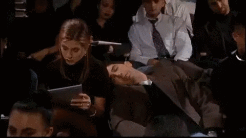

> «حضار که مثل دونه های ذرت پشت سر هم نشونده شدن، عموما سرشون تو گوشیه و استوری های رنگارنگ می‌بینن؛ یکسری چرت می‌زنن و گاهی که کلمه «شما حضار محترم» رو می‌شنون سرشون رو بالا میارن دوباره خیلی زودبه خواب‌های رنگارنگشون بر‌میگردن. بعضیاشون هم که رودرباستی کمتری دارن – نصف برنامه که میگذره- ناامید می‌شن و مجلس رو ترک میکنن»
> خوشحالی واقعی شرکت کننده ها کیه؟ وقتی که از همه تشکر می‌شه و دیگه می‌تونن بدون نگرانی از دلخور کردن کسی مراسم رو ترک کنن.»

##دلیل برگزاری این رویدادهای کسل کننده چیه؟

من فکر می‌کنم مهمترین دلیلش اینه که کارآفرین‌ها دارایی‌های حیاتی‌شون رو اشتباه می‌گیرن. مهمترین دارایی یک استارتاپ کاربراشه و باید رضایت اون‌ها رو مهمترین دغدغه خودشون قرار بدن. اما متاسفانه زندگی در یک کشور پر از مانع و مجوز برای خیلی‌ها این سوتفاهم رو به وجود آورده که نقطه شکست اصلی استارتاپ ها موضوع مجوزه. به همین دلیل هم اونا دارایی کلیدیشون رو دولتی‌ها می‌بینن، و ضیافتشون رو برای رضایت اون‌ها برپا می‌کنن.

تو این حالت هرچند در کوتاه‌مدت به هدفشون – که رضایت مسئولان هست!- می‌رسن و خوشحال و خندان با مسئولین عکس و ازشون وعده و وعید می‌گیرن، اما از این حقیقت غافلن که این عکس‌ها بیشتر از اینکه به درد استارتاپ ها بخوره به درد مسئولین میخوره تا باهاش آمارهاشون رو بسازن. از فردا که عکس‌ها گرفته شد و آمارها ساخته شد،‌ مسئولین پشت میزهاشون و کارآفرین‌های بیچاره پشت درهای بسته اون اتاق‌ها قرار می‌گیرن و همچنان به خاطر هر کار ساده‌ای مجبورن دنبال مجوز دربه دری بکشن.

پیشنهاد من اینه: حالا که قراره به دنبال مجوز بدویم، این کار رو با پشتوانه کاربران خوشحال انجام بدیم، نه کاربران خسته.

##افتتاحیه بلووک «چجوری» بود؟

ما توی بلووک باور داشتیم که مهمترین شرکامون مشتری‌ها هستن و نباید ذرت‌وار روی صندلی ها بشونیمشون تا به یک سری سخنرانی خسته‌کننده گوش بدن. این بود که افتتاحیمون رو طوری برنامه‌ریزی کردیم که بهشون خوش بگذره.

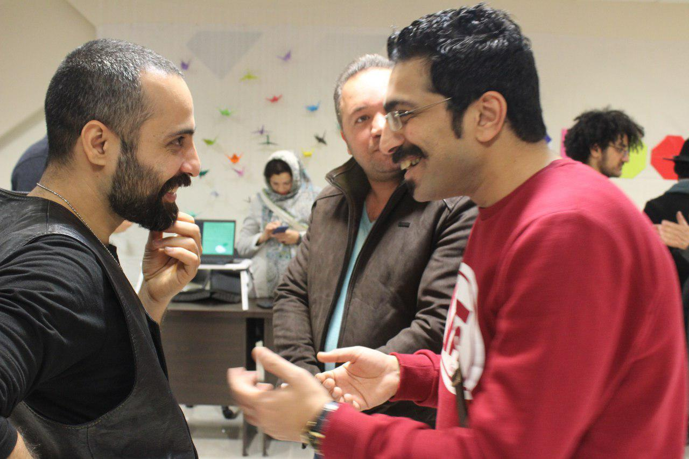

مثلا براشون یک تور طراحی کردیم تا غرفه به غرفه پیش برن و درباره مسائل مربوط به «بلووک» اطلاعات جذاب دریافت کنن.

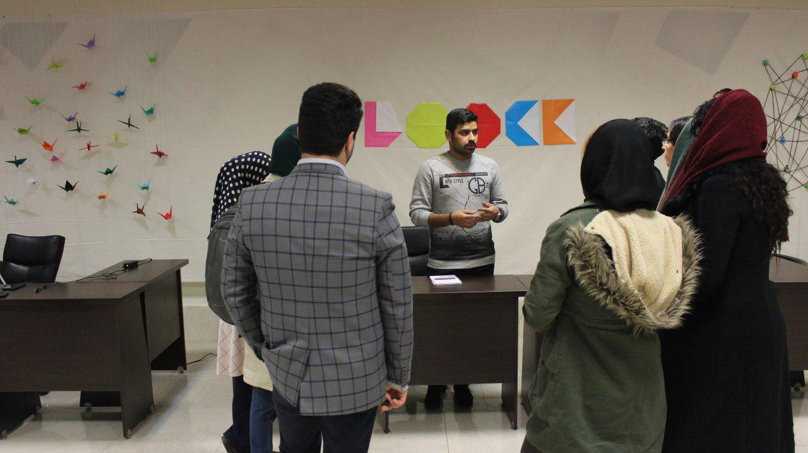

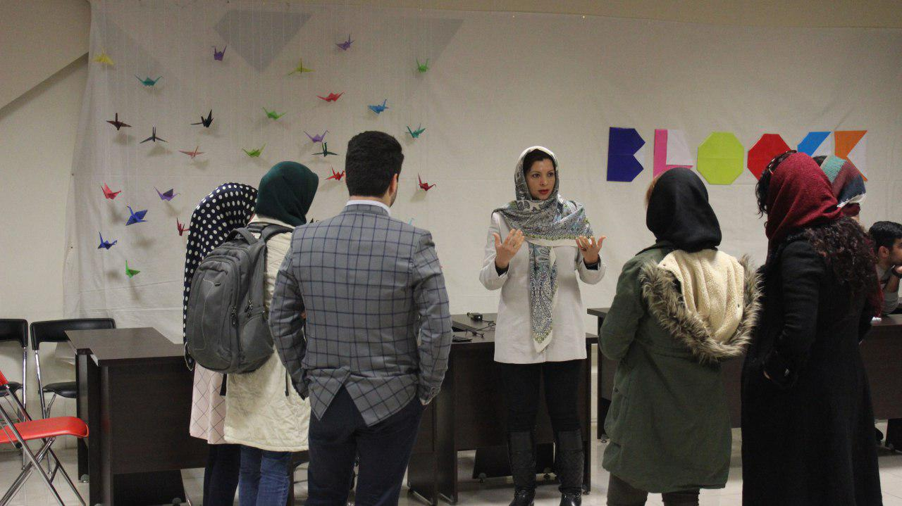

خواستیم خاطراتی بسازن و هدایایی با خودشون ببرن. پس غرفه اریگامی تدارک دیدیم تا بشینن و با کمک دو تا مربی لوگوی بلووک رو به صورت اریگامی درناست روبسازن ، روی یک بوکمارک نصب کنن و با خودشون ببرن.

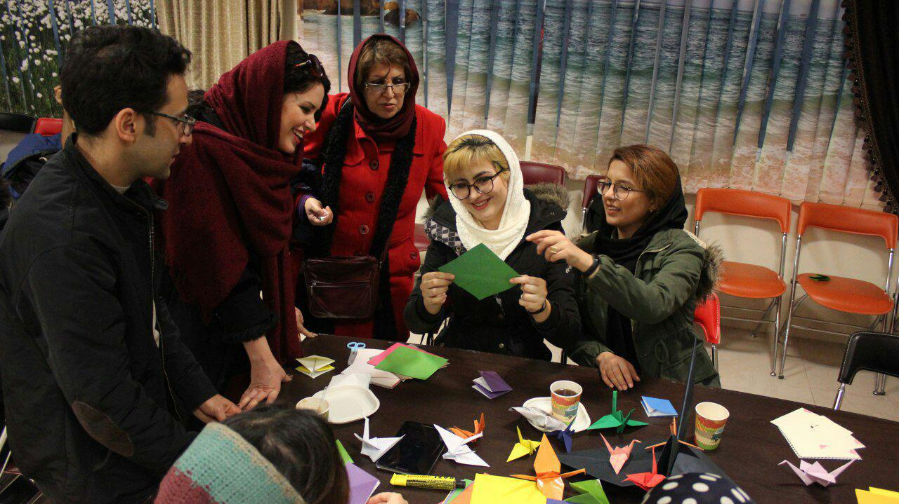

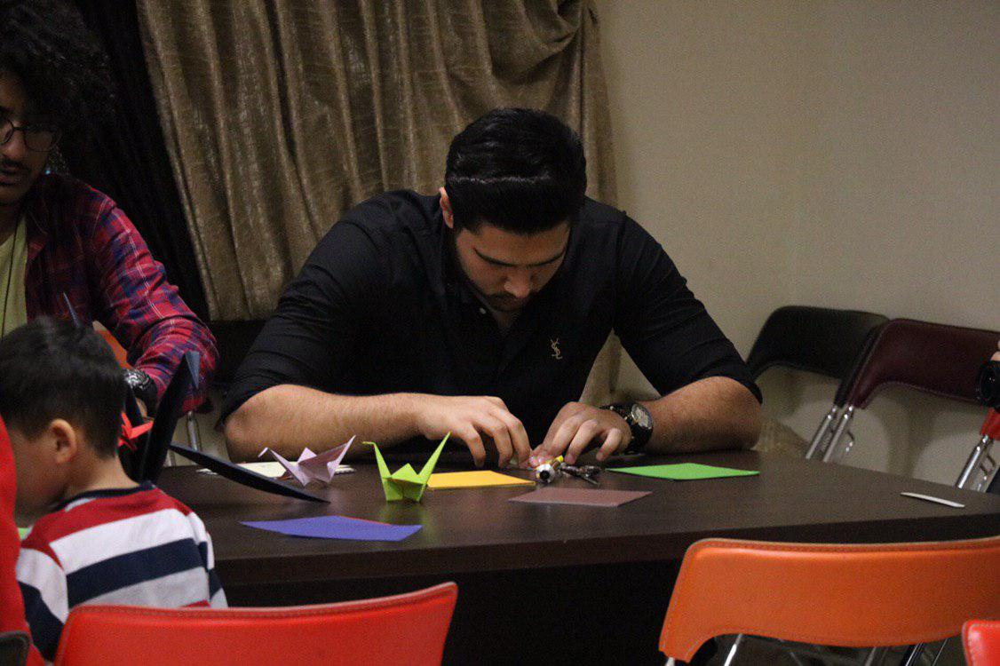

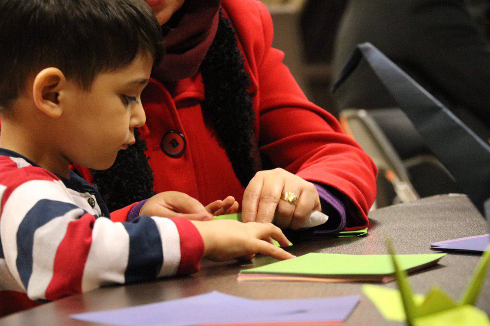

نتیجه این شد که به شرکت کنندگان خوش گذشت. نشون به اون نشون که مدام درحال عکس و استوری بودن

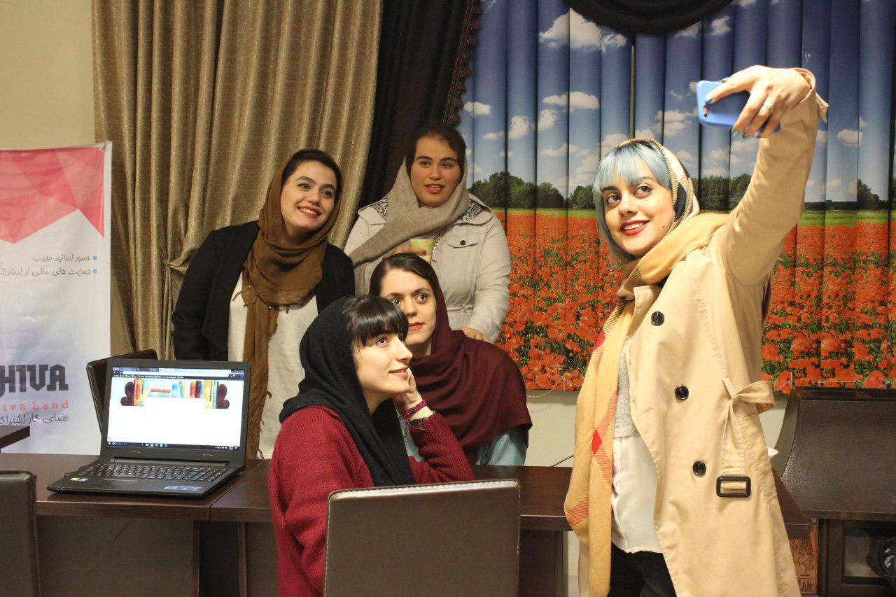

و در نهایت وقتی ساعت ارائه تموم شد اتفاق عجیبی افتاد.ساعت ۸ شب باید سالن **هیوالند** رو به شکل اولش درمیاوردیم و میز و صندلی هایی که ازش بیرون برده بودیم رو سر جاش می‌ذاشتیم.من به شوخی به شرکت‌کنندگانی که هنوز بودن گفتم «ساعت کار ما تمومه و اینجا رو باید تخلیه کنیم، پس یا وایسین کمک کنین سالن رو جمع و جور کنیم یا خداحافظی کنین و فرصت بدین ما این کار رو بکنیم». و نتیجه این بود:

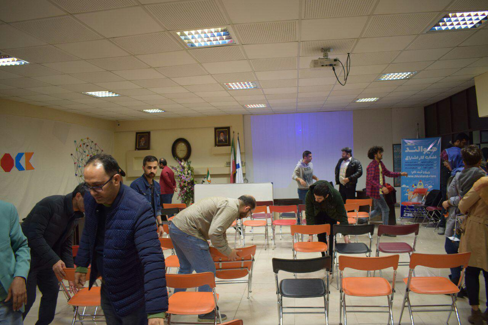

کاش عکس بهتری داشتم که میزان همکاری شرکت کنندگان رو بهتر نشون می‌دادم. بعضیاشون دوستانمون بودن اما بعضیاشون رو اولین بار بود که می‌دیدم. چند تا خانم بودن که میز و صندلی ها بلند می‌کردن و جابجا می‌کردن و حتی یکیشون عصبانی شد که چرا پسرها میزها رو از دستش می‌گیرن و اجازه نمیدن اون هم پا به پای بقیه کمک کنه!

##نکات آماری

در انتهای تور از شرکت کنندگان دعوت می‌کردیم که یک فرم رو پر کنن تا بدونیم نظرشون درباره بلووک و افتتاحیه ‌اش چیه و اینکه آیا دوس دارن باهاشون در تماس باشیم یا نه. دو اشتباه در طراحی این غرفه انجام دادیم. یکی اینکه توش فقط یک لپتاپ گذاشتیم که باعث می‌شد خیلی‌ها به خاطر شلوغی غرفه از پر کردن فرم صرف نظر کنن.

دوم اینکه همون یک لپتاپی که گذاشتیم هم کیبرد فارسی نداشت و تایپ کردن رو برای خیلی‌ها غیرممکن می‌کرد. این مشکل باعث شد از حدود ۱۳۰ نفری که توی افتتاحیه شرکت کردن تنها ۳۱ نفرشون فرم کامل ما رو پر کنن، هرچند با اضافه کردن قلم و کاغذ تونستیم ایمیل و شماره تلفن تعداد خیلی بیشتری از شرکت کنندگان رو بگیریم. آمار خروجی اون ۳۱ فرم رو باهاتون شیر می‌کنم

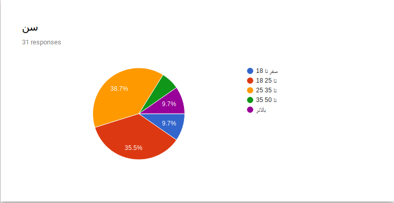

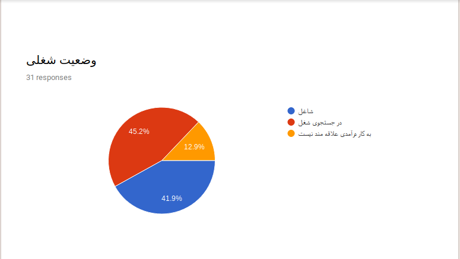

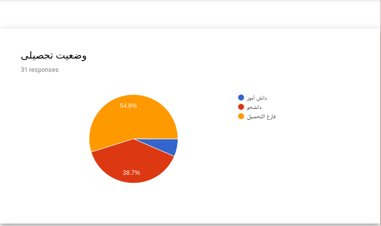

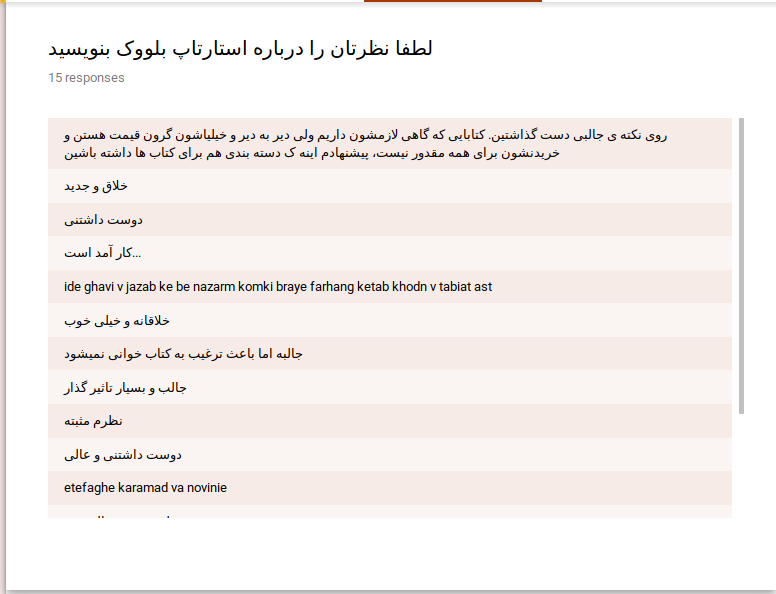

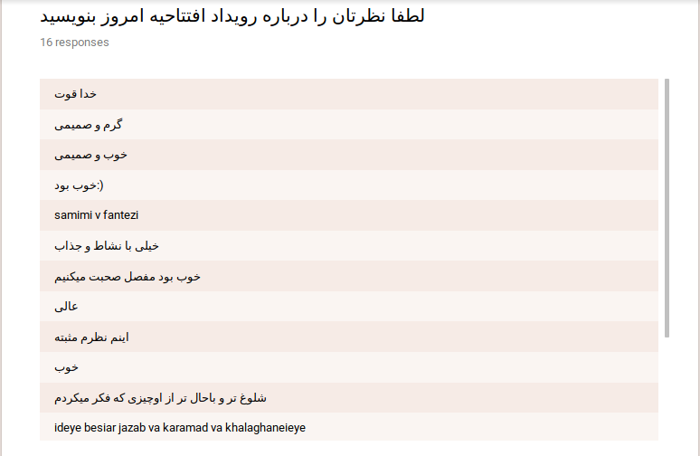

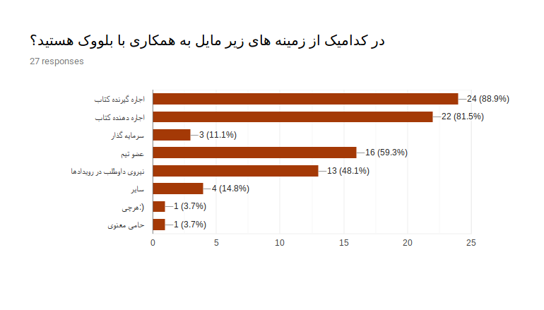

##نتیجه‌گیری

من فکر می‌کنم کاربرها ترجیح می‌دن «مهم باشن» و «میز جابه‌جا کنن» تا «مهم نباشن» و «خمیازه بکشن». این بود انشای من درباره اینکه «چگونه مشتریان وفادار» ایجاد کنیم!
