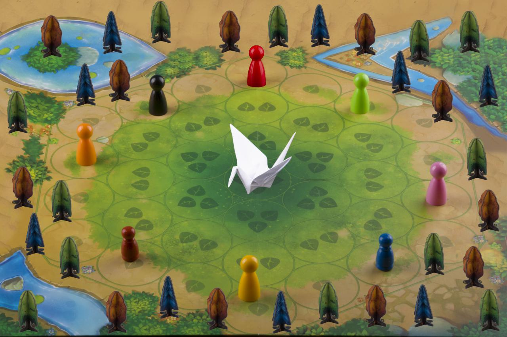

اگه به تاریخ کمپانی های بزرگ علاقه‌مند باشین احتمالاً متوجه یک مشکل شدین. تو روزهای اولیه اون‌ها تاریخی نوشته نشده. کسی نمیدونه روزهای اولیه گوگل چطور گذشت، مدیرانش چه دغدغه‌هایی داشتن،‌ چطور فکر می‌کردن و با چه مشکلاتی رو در رو بودن. کمپانی های دیگه هم همینطور. هرچند که بعدها تاریخ همه اون‌ها نوشته می‌شه و بنیانگذازانشون خاطرات زیادی از اون دوران نقل می‌کنن، اما علم «نوروسایکولوژی» به ما نشون داده که خاطرات ما اصلاً قابل اعتماد نیستن. ذهن ما یک دوربین دیجیتال نیست که اتقافات رو همونطوری که افتاده ضبط و بعدها پخش کنه.

نتیجه اینه که وقتی «سعید و حمید محمدی» بعد از ده سال خاطرات شروع دی‌جی‌کالا رو تعریف می‌کنه، خاطرات رو اونطور که «دوس داره » به خاطر میاره، نه اونطور که «واقعا اتفاق افتاده».

حالا چرا این موضوع برای **بلووک** مهمه!

###شفافیت
شفافیت یکی از مهمترین ارزش‌های بلووکه. ما توی بلووک همه چی رو شفاف می‌کنیم. به مرور خواهید دید که تمام قراردادها، کدها، صورت حساب‌های مالی و هر چیز دیگه ای که توی بلووک باشه – البته به جز پسوردهامون- به صورت شفاف در اختیار جامعه قرار می‌دیم. «شفافیت» یکی از مهمترین عناصر بلاکچینه و ما توی بلووک سعی می‌کنیم تمام قد ازش دفاع کنیم.

این کار برای ما به عنوان «کسب و کار اجتماعی» هم حائز اهمیته. چون کسب و کار اجتماعی در اصل متعلق به همه جامعه است و شفافیت کمک می‌کنه،‌ سرمایه گذاران و کاربران –که مهمترین ارزش هر پلتفرم رو به وجود میارن- مطمئن باشن سرمایه های مالی و معنویشون رو دارن روی سیستم سالمی سرمایه‌گذاری می‌کنن.

ما توی بلووک از سه نوع شفافیت دفاع می‌کنیم:

۱- شفافیت مالی: همه اسناد مالی ما به صورت غیرمحرمانه منتشر می‌شه. این کار برای سرمایه گذاران و کاربرانمون اطمینان ایجاد می‌کنه.

۲- شفافیت کد: تمام کدهای ما به صورت اپن سورس منتشر میشه. این کار به کاربران اطمینان می‌ده که کدهای ما قرار نیست حریم خصوصی اون‌ها رو نقض کنه یا اطلاعات غیر ضروری ای ازشون ذخیره کنه.

۳- شفافیت تاریخ: در فواصل معین سعی می‌کنیم خاطره نویسی کنیم و آرمان‌ها و چالش هامون رو با جامعه به اشتراک بزاریم. این کار به سایر استارتاپ ها و کسب و کارهای اجتماعی کمک می‌کنه از تجربیات خوب و بد ما استفاده کنن و قدم هاشون رو آگاهانه تر بردارن.

بهترین راه برای دنبال کردن تجربیات **بلووک** اینه که اکانت اون رو توی
[توییتر](/)
دنبال کنین.

### چندین سال پیش

برای اینکه بدونیم یک ایده از کجا شروع شده، گاهی نیازه خیلی عقب بریم. مثلاً یکی دوماه پیش «احسان» که یکی از شرکای قدیم و دوستان امروزمه بهم گفت تو همون هفت، هشت سال پیش هم که با هم کار می‌کردیم دوس داشتی سایت اجاره کتاب بزنی! و این درحالیه که من اصلاً همچین چیزی رو به خاطر نمیارم!

اما چون اینقدر عقب رفتن کمکی نمیکنه سفرمون رو کمی تند می‌کنیم و می‌رسیم به اونجاهایی که من به خاطر میارم.

###خرداد ۹۷ (آشنایی با اتریوم)
همین ایام بود که من با **بلاکچین اتریوم** آشنا شدم و رؤیایweb3 روز و شبم رو درآغوش کشید. برای کسانی که نمیدوننweb3 چیه خیلی خلاصه بگم: «اینترنت غیر متمرکز». که باعث می‌شه داده‌های ما توی بلاکچینی ذخیره بشه که در اختیار همه مردمه، نه سرورهای مهر و موم شده شرکت های غول آسا.

امکاناتی که بلاکچین به دنیامون میده منو به شوق آورده بود، اما چند ماه طول کشید تا بتونم پروژه ای پیدا کنم که هم دوسش داشته باشم و هم به نظرم اجراش با بلاکچین منافع واقعی رو بهش اضافه می‌کنه که به پیچیدگی‌هاش می‌ارزه.

### 10 آبان ۹۷ (تولد ایده)

فکر کنم اگه بخوایم روز تولدی برای ایده «بلووک» در نظر بگیریم همین روز باشه. تو این تاریخ بود که
[پوریا](https://www.instagram.com/pourya_meydani/)
از
[خانه کتاب گرگان](https://www.instagram.com/explore/locations/326506347/)
برام تو تلگرام پیام گذاشت و مشورت کرد.

[وویس خود پوریا رو از اینجا گوش کنین](puria.mp3)

سیستم مدنظر «پوریا» باید چه خصوصیاتی داشته باشه:

> - پلتفرمی باشه که افراد بتونن توش کتاب بزارن و کتاب بگیرن.
> - امکان ردیابی کتاب‌ها باشه تا اهدا کننده در هرلحظه بدونه کتابش کجا است.
> - سیستم بتونه امنیتی به وجود بیاره تا کتاب‌ها دزدیده نشن و اتفاقی که برای دیوار مهربانی افتاد برای «قفسه مهربانی» اون نیفته.
> - این سیستم هزینه نگهداری زیادی رو به «پوریا» و خانه کتاب تحمیل نکنه و تا حد امکان مستقل از حمایت مالی و فنی پوریا بتونه سرپا بمونه.

موافقین که داریم یک پلتفرم مبتنی بر **بلاکچین** رو توصیف می‌کنیم؟ اینجا بود که فهمیدم ایده ای که می‌خواستم رو پیدا کردم. البته با یک سری تغییرات.مثلاً افراد بتونن از در اختیار قرار دادن کتاب‌هاشون درآمد داشته باشن تا انگیزه بیشتری برای این کار داشته باشن.

روزهای اولی رو به مشورت با «هاله» و
[امید](https://www.instagram.com/jaliliomid/)
و
[فرهاد](https://www.linkedin.com/in/sepidfekr/)
و
[شایان](https://www.linkedin.com/in/sshayans/)
و
[شفیق](https://www.linkedin.com/in/shafigh-shojaeian-b8ba7544/)
گذروندیم. فکر می‌کنم مشورت های این بچه‌ها تو روزهای اولیه خیلی کمکم کرد که ایده و انگیزم ثبات پیدا کنه.

هاله مشورت داد و اعلام کرد حاضره به عنوان سرمایه گذار هم به مجموعه اضافه بشه اگه با ۵ تا ۱۰ میلیون تومان کار انجام می‌شه.

امید چندین شب به صورت مکرر توی واتزآپ وقت گذاشت و کمکم کرد ایده رو درحالات مختلف بررسی کنیم.

فرهاد هم برای بررسی ایده کمکم کرد و اسم «bloock» رو با ترکیب «book» و «block» ساخت.

شایان که مدیر
[هیوالند](https://www.instagram.com/jaliliomid/)ه
بهم اطمینان داد می‌تونم از فضای کار اشتراکی هیوالند برای این کار استفاده کنم و بهم کمک می‌کنه سرمایه گذار پیدا کنم.

شفیق در ابتدا به عنوان هم‌تیمی بهم اضافه شد و توی شکل دادن ایده کمکم کرد اما به مرور به این نتیجه رسید که فرصت کار تمام وقت روی ایده رو نداره و باهام خدافظی کرد.

###۲۱ آبان ۹۷ (تلاشی که به ثمر ننشست)
قبل از تعریف محصول باید پاسخ یک سری سؤال رو پیدا می‌کردم. مثلا احتیاج داشتم بدونم واقعاً کسی علاقه‌مند به اجاره کردن کتاب هست؟ چه چالش‌هایی تو این کار پیش میاد؟ چند درصد کتاب‌ها سوخت می‌شه و چطور میشه این درصد رو پایین آورد؟ و پاسخ‌هایی از این قبیل.

برای پاسخ به سؤال اول یک «گوگل فرم» تهیه کردم و از «پوریا» خواستم هرکسی که می‌آد کتابی رو اجاره کنه،‌ الکی بهش بگه این کتاب برای اجاره هم موجوده تا بفهمیم واقعاً مردم به اجاره کردن کتاب علاقه دارن یا نه. قرار بود جواب هاشون رو به همراه اطلاعات شخصیشون توی فرم ذخیره کنیم تا کمکون کنه مخاطب هامون رو بشناسیم. اما بعد از چند روز متوجه شدم انگار «پوریا» انگیزه‌ای برای این کار نداره. اینکه «حوصله نداشت» یا «دوس نداشت به مشتریاش این حرفو بزنه» رو نفهمیدم اما به هرحال فهمیدم که باید دنبال راه حل دیگه ای باشم.
در اینجا ممکنه فکر کنید که پوریا چون خودش کتابفروشی داشت مارو رقیب خودش می‌دونست و دوس نداشت کمکمون کنه. اگه واقعاً اینطور فکر می‌کنید بهتون حق می‌دم. چون پوریا رو نمیشناسین و نمی‌دونین چه عشقی به گسترش فرهنگ کتابخونی داره. نشون به اون نشون که بعدها هم برای اطلاع رسانی کانال ما و فعالیت‌های ما باهامون همکاری کرد و مثلاً تیزر افتتاحیمون رو تو کانالش منتشر کرد و از مشتریاش خواست اونجا شرکت کنن.

برای خواندن بخش دوم مقاله به
[اینجا](/)
مراجعه نمایید
