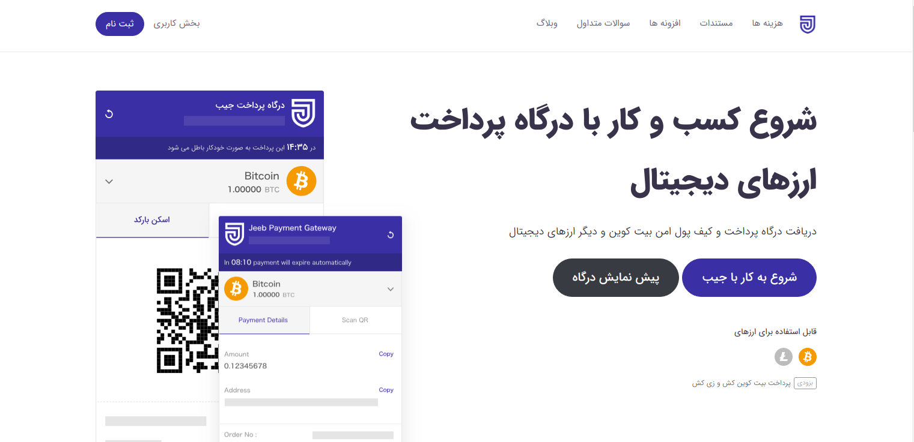
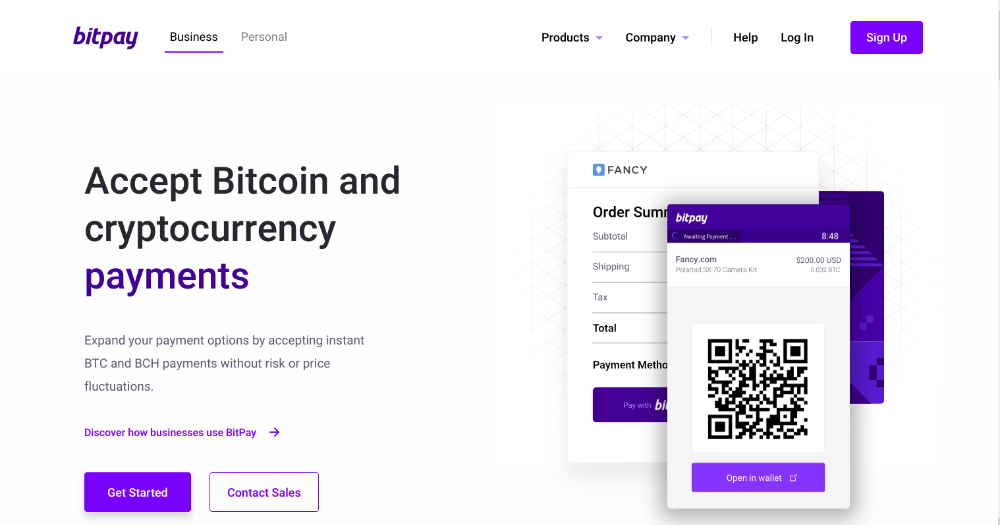
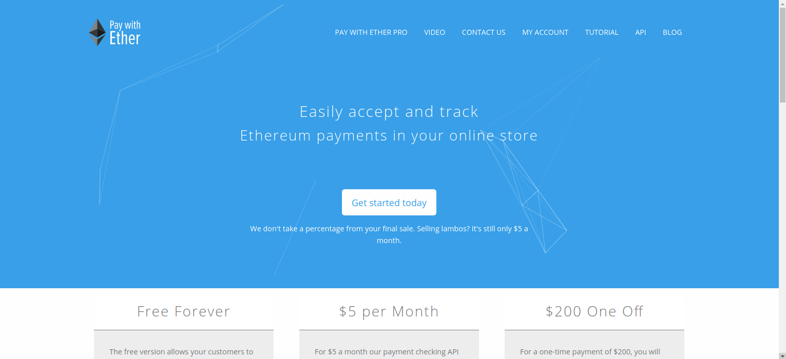
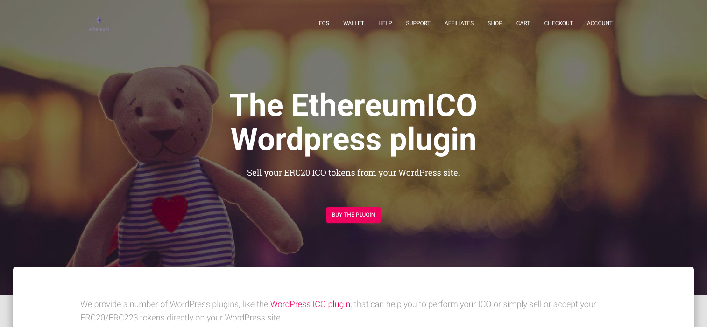

تو مطلب قبلی تحت عنوان «آقای بلووک قرار ما این نبود» نوشتم که میخوایم MVP یا همون (کوچیکترین محصول پذیرفتنی) مون رو با وردپرس بیاریم بالا و از خیلی از فیچرها مثل پرداخت با اتریوم تو این ورژن منصرف شدیم.

اما راستش یک بی‌خوابی ساعت ۳ نصفه شب، تشویقم کرد بگردم ببینم می‌تونم افزونه وردپرسی ای پیدا کنم که کمکم کنه بی دردسر امکان پرداخت با اتریوم رو هم به وبسایتم اضافه کنم و بتونم این موضوع رو هم تو MVP چک کنم؟

بعد از ۴ روز جستجو و تلاش امروز بالاخره پاسخم رو گرفتم. جواب کوتاهش اینه «به نام خدا! بله». اما اگه دنبال جواب بلندتری هستید در ادامه مطلب همراهم باشین تا در جریان افزونه هایی که تست کردم و نتیجه‌ای که از هرکدوم گرفتم قرار بگیرین.

##جیب

[جیب](https://jeeb.io/)
، تنها درگاه ایرانی ای بود که بهش برخوردم. چون دیده بودم توی ویرگول هم مطلب می‌زارن بهشون امیدوار بودم. تنها مشکلی که در شروع کار به نظر میومد این بود که تنها از بیتکوین و لایت‌کوین پشتیبانی می‌کرد و اتریوم که ارز مورد علاقه منه رو توی لیستش نداشت که این مشکل بزرگی نبود.از علاقه من مهمتر علاقه کاربراست و فکر کردم شاید فرصت بده پرداخت با بیتکوین رو تست کنم.
مشکلی که در ابتدا با این افزونه داشتم این بود که قیمت محصولات رو بدون تبدیل کردن به بیتکوین نشون میداد. مثلاً قیمت اجاره کتابی رو که توی ووکامرس ۳۰۰۰ تومان زدم توی درگاه ۳۰۰۰ بیتکوین وارد می‌شد و اینجوری احتمالاً هر کتابم تبدیل به گرون ترین کتاب تاریخ می‌شد!
واسشون تیکت ثبت کردم تا بفهمم این مشکل چطور حل می‌شه اما تاالان که 5 روز از تاریخ ثبت تیکت گذشته جوابی ازشون دریافت نکردم.

اول فکر کردم شاید پروژه رو رها کردن، اما وقتی دیدم تاریخ
[آخرین پستشون](https://virgool.io/@jeeb/درگاه-پرداخت-بیت-کوین-برای-وردپرس-ووکامرس-fqjlhgvtuvlj)
تو ویرگول به دو هفته قبل برمیگرده نظرم عوض شد. به هرحال اگه بچه‌های جیب بخوان به قول مامانم همین چند تا مشتری «کل و کورشون» رو نگه دارن، بهتره وضعیت پشتیبانیشون رو بهبود بدن.

##Bitpay

[BitPay](https://bitpay.com/)
افزونه دیگه ای بود که امتحان کردم. این
[آموزش فارسی](https://skaarp.com/پرداخت-با-بیت-کوین-در-ووکامرس/)
رو هم می‌تونید دربارش ببینید. بیت پی هم اتریوم قبول نمی‌کرد و مهمتر اینکه تو مرحله ثبت درگاه اطلاعات زیادی درباره کشور و آدرس شرکت و شماره تلفن و کدپستی و غیره میگرفت که باعث شد ترس تحریم برم داره و بی‌خیالش شم.
نکته اینجاست که جعل کردن این همه اطلاعات در شرایطی که دامین وبسایتتون «ir.» هست چندان معقول به نظر نمیاد!

##Pay With Ether

با پیدا کردن این
[سایت](https://www.paywithether.com/)
و
[افزونه وردپرسش](https://wordpress.org/plugins/pay-with-ether/)
به نظر می‌یومد بالاخره تونستم ستاره اقبال رو در آغوش بکشم! اما اینجا هم به مشکل خوردم. بعد از نصب افزونه و تنظیماتش با یک ارر مواجه شدم که با سرچ کردن هم نتونستم حلش کنم. توی بخش ساپورت افزونه مشکلم رو مطرح کردم ولی تا همین امروز جوابی به سؤالم ندادن. در نتیجه به سراغ افزونه بعدی رفتم.

(خطر اسپویل: تو افزونه بعدی هم به همین مشکل برمی‌خورم اما بخش ساپورت اون‌ها راهنماییم کرد و مشکل حل شد. جواب راه حل رو خودم تو
(فروم)[https://wordpress.org/support/topic/unable-to-provide-an-order-value-in-eth-at-this-time-please-contact-support-2/]
این‌ها نوشتم تا دولوپرهای بعدی مشکلشون حل شه).

##Ether and ERC20 tokens WooCommerce Payment Gateway

سایت
[Ethereumico](https://ethereumico.io/)
خدمات جالبی داره که پیشنهاد می‌کنم ببینین. افزونه های وردپرسش هم باحالن. مثل افرونه ای که بهتون امکان می‌ده ICO برگزار کنین یا افزونه ای که به کاربراتون امکان ساخت ولت اترویم می‌ده. هرچند دو افزونه بالا پولی هستن، اما در کنارشون یک افزونه رایگان خیلی دوس داشتنی با یک اسم خیلی طولانی Ether and ERC20 tokens WooCommerce Payment Gateway دارن که به کاربراتون امکان می‌ده بتونن با کمک
[Meta Mask](https://metamask.io/)
پرداخت اتریومی داشته باشن.
با اینکه افزونشون یک سوم افزونه بالایی نصب داشت اما پشتیبانی بهتری داشتن و خیلی سریع
[راهنماییم کردن](https://wordpress.org/support/topic/unable-to-provide-an-order-value-in-eth-at-this-time-please-contact-support/)
تا بتونم مشکلم رو حل کنم.

##نتیجه

حالا دیگه کاربران سایت می‌تونن برای اجاره کردن کتاب از «اتر» استفاده کنن. اگه فکر می‌کنین حالا کی اتر داره که بیاد کتاب اجاره کنه باید کمی صبر کنین. واسه اون هم برنامه داریم…
در نهایت فراموش نکنین که سایتمون فعلاً در حال تست با کاربرای تستیه که همه توی گرگان هستن. به همین دلیل هم سابدامین تستیمون رو اعلام نمیکنم. شما هم اگه پیداش کردین نیان توش اتر خرج کنین که فعلاً خدماتی خارج گرگان نداریم.
یادتون نره خدا با «صبر پیشه کنندگان» هست :wink:
