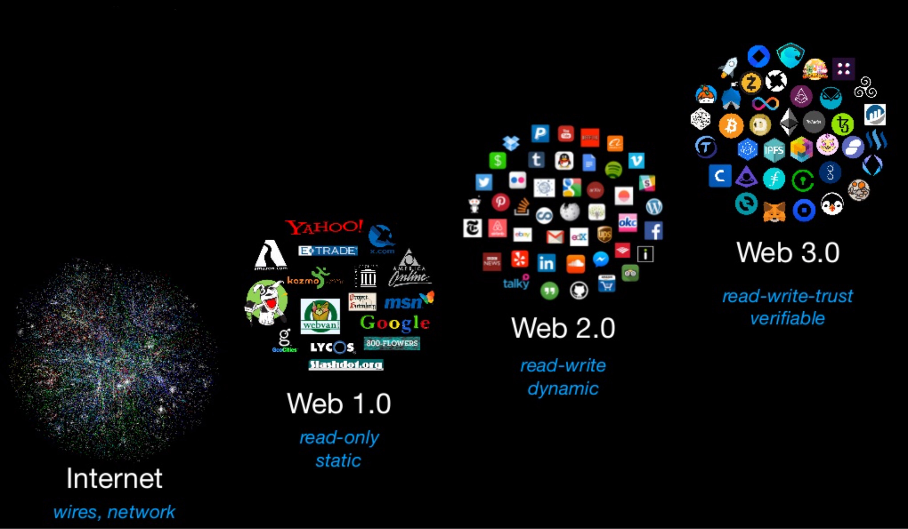
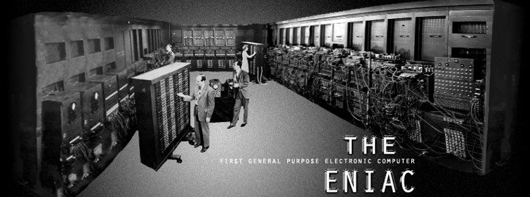
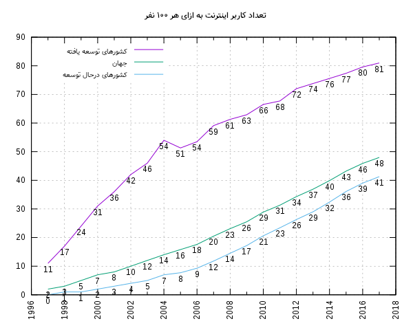
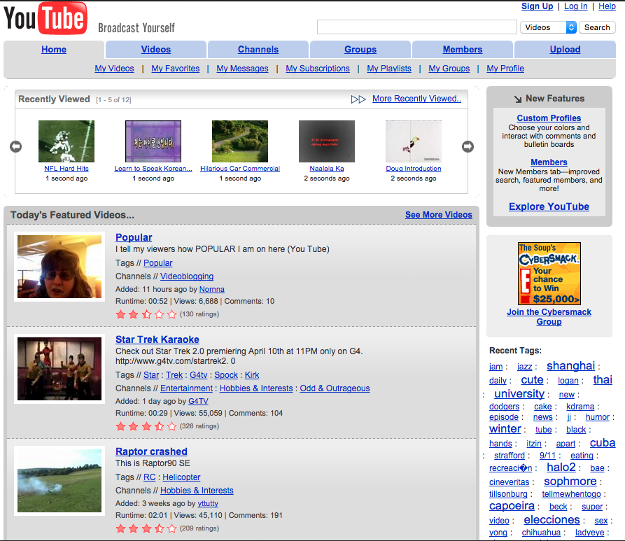
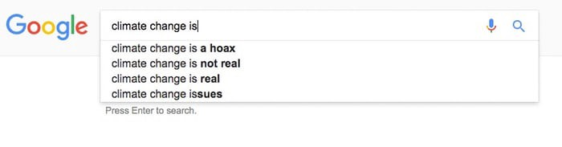

در این مقاله نگاهی به تاریخ
**وب**
می‌ندازیم و آرزو می‌کنیم مشکلات
**web3**
حل بشه و دنیا از مزایاش بهره‌مند بشه،‌ حتی اگه ما نباشیم اون روز رو ببینیم. این مطلب ترجمه نسبتا آزاد از این
[مقاله](https://hackernoon.com/paradigm-shift-from-web1-0-to-web3-0-6b7bfae72a69)
است که در hackernoon منتشر شده

##نسل اول: web1

اگر به عقب برگردیم – حدوداً سالهای ۱۹۵۰ میلادی- با کامپیوترهایی مواجه می‌شیم که برخلاف کامپیوترها و موبایل ها امروزی بسیار حجیم بودن. اینقدر حجیم که فضای یک اتاق رو به صورت کامل پر‌ می‌کردن و تنها دانشمندان و محققان امکان استفاده ازشون رو داشتن. «اینترنت» به عنوان یک ارتباط غیر peer-to-peer ، در رؤیاهای اون دانشمندان هم نمی‌گنجید.

> تو مدل رایج‌تر اینترنت، یک سرور مرکزی داریم و همه کامپیوتر ها از طریق اون به همدیگه وصل میشن.
> اگه از bitTorrent فیلم دانلود کرده باشین، احتمالاً می‌دونین که تو اون سیستم سرور مرکزی وجود نداره و تمام کامپیوترها مستقیماً به همدیگه متصل شدن و تیکه های فیلم و موسیقی رو برای همدیگه میفرستن.

در سال ۱۹۶۹ یک برنامه تحقیقاتی به اسم
[ARPANET](https://fa.wikipedia.org/wiki/%D8%A2%D8%B1%D9%BE%D8%A7%D9%86%D8%AA)
توسط
[اداره برنامه‌ها و تحقیقات پیشرفته دفاعی آمریکا](https://fa.wikipedia.org/wiki/%D8%AF%D8%A7%D8%B1%D9%BE%D8%A7)
یا «DARPA» اجرا شد که به پروژه های تحقیقاتی نظامی آمریکا این امکان استفاده مشترک از «سوپرکامپیوترها» رو می‌داد. پروژه ‌ARPANET رو می‌تونیم نسخه اولیه اینترنت امروزی بدونیم.

اگه کمی سریع‌تر حرکت کنیم، به سال ۱۹۹۳ می‌رسیم. جایی که اولین مرورگر اینترنتی به نام
[NCSA Mosaic](https://en.wikipedia.org/wiki/Mosaic_%28web_browser%29)
شروع به کار کرد.
در سال ۱۹۹۵ مرورگر Netscape به بازار اومد و اینترنت رو به یک جریان تاثیرگذار در عالم تبدیل کرد.

##نسل دوم: web2

نسل بعدی
**وب**
بر شانه های غول‌هایی مثل گوگل و فیس‌بوک و آمازون رشد کرد.بانکداری الکترونیک اجازه پرداخت پول بر بستر اینترنت رو برای ما فراهم کرد. وب‌سایت هایی مثل ویکیپدیا و یوتیوب هم اومدن و به ما امکان جستجو درباره اطلاعات و فیلم‌ها رو دادن.
اینجا فرصت مناسبیه که یادی از اجدادیکی از وب‌سایت های خیلی محبوب امروز بکنیم:

‌

فیس‌بوک و سایر شبکه‌های اجتماعی به افراد امکان دادن تا به راحتی به افراد دیگه - در هرکجای کره زمین- متصل بشن و باهاشون نوعی معاشرت مجازی رو انجام بدن.
آمازون به عنوان یک کمپانی کتاب شروع کرد و حالا از شیر مرغ تا جون آدمیزاد، از کتاب‌های فیزیکی تا سرویس‌های ابری رو عرضه می‌کنه.
گوگل و سایر موتورهای جستجو با ایندکس کردن محتوای وب به ما امکان دادن به راحتی بتونیم به مطالب مختلف که روزانه از گوشه و کنار دنیا سر‌برمیارن، دسترسی داشته باشیم.

**web2**
حجم عظیمی از سرویس های فوق‌العاده باکیفیت رو در اختیارمون گذاشت. سرویس های که در گذشته تصورش رو هم نداشتیم. همه این‌ها جالب‌تر می‌شه اگه فکر کنیم این همه سرویس‌ها رو «رایگان» به دست آوردیم!
اما واقعیت ‌اینه که هیچ چیز رایگان نیست و گوگل و فیس‌بوک و آمازون هم بهای سرویس‌هاشون رو بیشتر از همه کمپانی‌های سابق دنیا از ما گرفتن و می‌گیرن.

> وقتی برای یک محصولی پولی بهایی نمی‌پردازید،‌ بدانید که آنجا «محصول» خود شما هستید!

این‌ها هزینه‌هاییست که برای استفاده از هر سرویس متمرکزی (centralized service) می‌پردازیم:

- تغییرات خودسرانه و یکطرفه
  [قوانین سرویس‌دهی](https://fa.wikipedia.org/wiki/%D8%B4%D8%B1%D8%A7%DB%8C%D8%B7_%D9%88_%D9%85%D9%82%D8%B1%D8%B1%D8%A7%D8%AA_%D8%B3%D8%B1%D9%88%DB%8C%D8%B3%E2%80%8C%D8%AF%D9%87%DB%8C)
  یا همون(Term of services)
- واگذاری «حق مولف» به این کمپانی ها (شاید نمی‌دونین که قانوناً کمپانی فیس‌بوک و خیلی از پلتفرم‌های دیگه مالک محتوایی هستن که شما توش تولید می‌کنین و به اشتراک می‌زارین)
- برچیده شدن سرویس از طرف سرویس دهنده
- سانسور
- استفاده از اطلاعات ما برای «تبلیغات هدفمند» که شدیداً ناقض حریم خصوصی ماست.
- تقسیم ناعادالانه ثروت و قدرت.( برای اطلاعات بیشتر می‌تونین به مقاله
  [سهم مارو دزدیدین، دارین باهاش پز می‌دین](https://mrnewid.ir/سهم»%20مارو%20دزدیدین،%20دارین%20باهاش%20پز%20می‌دین/)
  مراجعه کنین)
- دستکاری (مثلاً در نتایج جستجو)

تاریخ وب به کرات شاهد پرداختن این هزینه‌ها توسط مصرف کنندگان خدمات مرکز‌محور – یا همون سرویس های متمرکز- هست .
اگه بخوایم این برهه از تاریخ رو با نام این کمپانی‌ها به خاطر بیاریم،‌ شاید بد نباشه که در کنار تمام محصولات خوبی که به ما دادن، بهایی که براشون پرداختیم رو هم به خاطر بیاریم. بهایی که اون‌ها رو جزو ثروتمندترین کمپانی‌های تاریخ کرد!

##نسل سوم: web3

**روزنامه تایمز سوم ژوئن ۲۰۰۹: دولت انگلیس برای دومین بار به بانک‌ها کمک می‌کند**

این کنایه‌ای هست که ۹ سال پیش،‌توی
**بلاک صفر**
بلاک‌چین بیتکوین (اولین بلاک‌ زنجیره که به نام «جنسیس» مشهوره) نوشته شده و ضعف سیستم‌های مالی متمرکز رو هدف قرار داده. بلاکچین انقلابی در حوزه مالیه، اما محدود به اون نیست. خیلی زود مردم فهمیدن که بلاک‌چین در حوزه هایی به غیر از «پول» هم کاربرد خیلی زیادی می‌تونه داشته باشه. مثلا:

- تأیید هویت (فرضاً برای ثبت املاک و یا مدارک دانشگاهی)
- لجستیک ( پیگیری زنجیره تامین)
- سرمایه‌گذاری جمعی (Crowdfunding)
- قمار
  -شرط بندی
- شبکه‌های اجتماعی
- اینترنت چیزها
- رای‌گیری
- و …

برای ساخت این خدمات نیاز به انجام محاسبات در یک روش شفاف و بدون واسطه وجود داشت، که مستلزم سانسور و تمرکز قدرت نباشه.
این نیاز توسط سایر کریپتوکارنسی ها که به اصطلاح
[colored coin](https://bitcoinist.com/colored-coins-work-bitcoin-blockchain/)
یا سکه‌های رنگی نامیده می‌شن پوشش داده شد. این سکه ها در اصل لایه‌هایی بودن که توسط زبان اسکریپت نویسی بیتکوین روی شبکه اصلی بیتکوین ساخته می‌شدن و هدفشون ذخیره اطلاعات اضافی روی شبکه بیت‌کوین بود.

> بیت‌کوین دروازه‌ای بود که تاریخ رو به نسل سوم **وب** وارد کرد.

در نهایت نیاز به محاسبات پیچیده‌تر و چند منظوره‌تر روی بلاک‌چین، باعث شد در سال 2015 **بلاکچین اتریوم**
متولد بشه. اتریوم با اضافه کردن قابلیت **قراردادهای‌ هوشمند** و ساختن توکن هایی برای اون‌ها امکان ساخته شدن **اپلیکیشن‌های غیرمتمرکز** رو به وجود آورد. اپلیکیشن هایی که به ما امکان می‌دن بدون نیاز به یک «سرور مرکزی» داده هامون رو تحلیل و تبادل کنیم. این اپلیکیشن ها رو به اختصار **Dapp** می‌گیم که مخفف عبارت Decentralized Application هست.

قراردادهای هوشمند با نوشتن کدهایی ساده - که داده‌هایی رو روی بلاکچین اتریوم ذخیره می‌کردن - شروع شدن و امروزه در قالب اپلیکیشن های متنوعی عرضه می‌شن.
اون‌ها در واقع، امکان ساخت توکن های ERC20 که به عنوان «رمزارز» یا همون کریپتوکارنسی استفاده میشن، بازی‌هایی مثل کریپتوکیتی، صرافی‌ها، اپلیکیشن‌های اعطای وام، شبکه‌های اجتماعی، سایت‌های خرید و فروش و تقریباً هر سرویس دیگه ای که امروزه «متمرکزها» به ما می‌دن، رو بدون نیاز به سرور مرکزی برای ما فراهم می‌کنن. وقتی از ذخیره داده توی سرورهای کمپانی ها خبری نباشه، از معایبی که در بالا گفتیم هم خبری نیست!

البته Dapp ها هم فعلاً با مشکلات خاص خودشون دست به گریبانن که مانع استفاده گسترده ازشون می‌شه. مثلا:

- پیچیدگی استفاده: کار کردن با اون‌ها برای کاربران آموزش ندیده سخت و پیچیدست.
- مقیاس‌پذیری: در حال حاضر این سیستم‌ها نمی‌تونن صدها هزار تراکنش در ثانیه که ازشون انتظار می‌ره رو مدیریت کنن.

- امنیت: هرچند هک کردن این سیستم‌ها به راحتی امکان‌پذیر نیست، اما در صورتی که اتفاق بیفته راهکاری برای برگردوندن اطلاعات و سرمایه ها به صاحبانش وجود نداره و این اصلاً خوشایند نیست. هک معروف
  [DAO](https://arzdigital.com/seven-cryptocurrency-hacks/)
  اهمیت این موضوع رو نشون می‌ده.
- حریم خصوصی: تمام اطلاعات روی شبکه اتریوم شفاف هستن و می‌تونن توسط همه کاربران دیده بشن. هرچند سکه هایی مثل monero، Zcash و … امکان پرداخت ناشناس رو دارن و خبرهایی هست که اتریوم هم می‌خواد این قابلیت رو اضافه کنه، اما خود این موضوع پیچیدگی هایی رو به وجود آورده که باید منتظر باشیم و ببینیم چطور قراره حل بشن. بخوام خیلی خلاصه این پیچیدگی ها رو نشون بدم اینطوری می‌شه: (پرداخت ناشناس= امکان پولشویی، پرداخت قابل دید برای همه= امکان نقض حریم خصوصی)

##سخن پایانی
همین که دانه‌ای در دل خاک تیره قرار گرفت پیروز است. فقط مدتی صبر باید تا پیروزی آن را در قالب درخت مشاهده کنیم.
