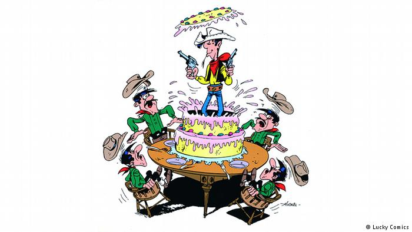
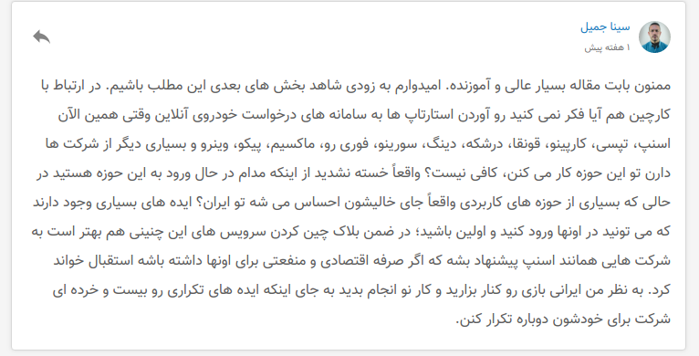
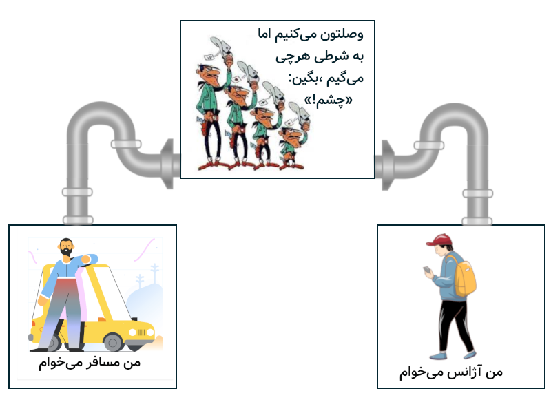
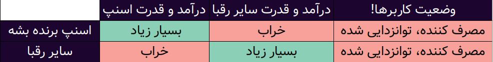
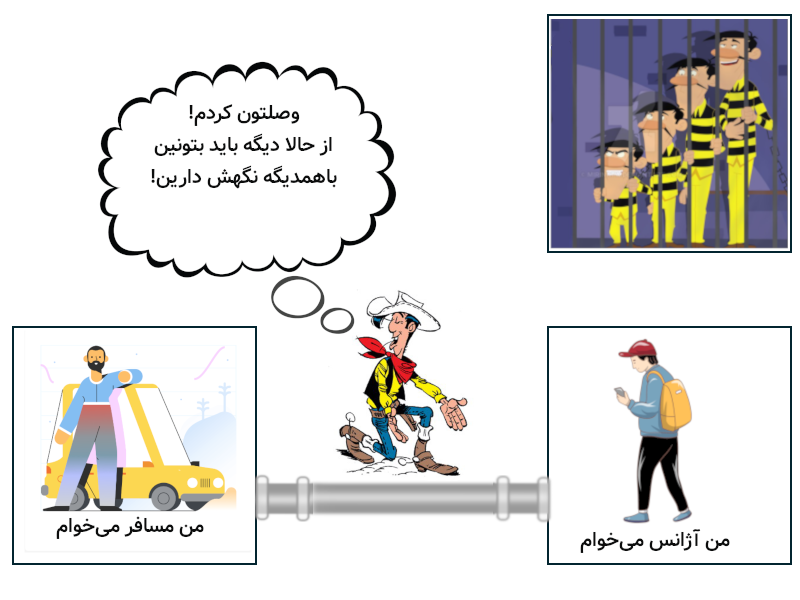
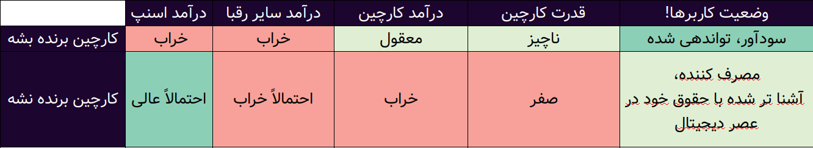

حدوداً دو هفته پیش **کارچین** (استارتاپ اجاره خودرو بر بستر بلاکچین)، مقاله‌ای با عنوان
[اقتصاد اشتراکی و بلاک‌چین (بخش اول: اقتصاد اشتراکی؛ نوشدارویی که نبود!)](https://blog.carchainnet.ir/%D8%A7%D9%82%D8%AA%D8%B5%D8%A7%D8%AF-%D8%A7%D8%B4%D8%AA%D8%B1%D8%A7%DA%A9%DB%8C-%D9%88-%D8%A8%D9%84%D8%A7%DA%A9%DA%86%DB%8C%D9%86-%D8%A8%D8%AE%D8%B4-%D8%A7%D9%88%D9%84-%D8%A7%D9%82%D8%AA%D8%B5%D8%A7%D8%AF-%D8%A7%D8%B4%D8%AA%D8%B1%D8%A7%DA%A9%DB%8C%D8%9B-%D9%86%D9%88%D8%B4%D8%AF%D8%A7%D8%B1%D9%88%DB%8C%DB%8C-%DA%A9%D9%87-%D9%86%D8%A8%D9%88%D8%AF-kmjmf99egrm9)

کاربری به نام «سینا جمیل» در بخش نظرات موضوعی رو باز کرد که به نظرم ارزش مشارکت و پاسخ‌گویی داشت. وقتی شروع به نوشتن کامنت کردم دیدم مطالب عمیق‌تر و پیچیده‌تر از اونه که بشه توی یک کامنت بهش پاسخ داد. پس تصمیم گرفتم جواب سینا رو با یک مقاله بدم و دیگران رو هم به مشارکت در گفتمان دعوت کنم

سینا جان سلام

درسته که سوالت رو مستقیما از «کارچین» پرسیدی اما به عنوان عضوی از کامیونیتی استارتاپی بلاکچین ایران مشتاقم که توی این بحث شرکت کنم.

##مقایسه «کارچین» با «اسنپ و بقیه باجگیر‌ها»
مقایسه «شیوه رقابت تپسی و کارپینو و . ... با اسنپ» با شیوه «رقابت کارچین» کاملا اشتباهه. دعوتت می‌کنم به این سؤال فکر کنی که تفاوت مدل کسب و کار اونها با اسنپ چیه؟ تقریبا هیچی!
فارغ از اینکه اون کمپانی‌ها دارن رقابت رو در زمین اسنپ دنبال می‌کنن و به همین دلیل یا محکوم به شکستن یا مجبورن به سهم بازار کوچیکتر قناعت کنن،‌ اینجا موضوع مهمتری برای من و تو وجود داره.
بیا از یک منظر دیگه به این ماجرا نگاه کنیم. مشکلی که وجود داره و راه حلی که اسنپ و برادرانش ارائه می‌کنه، چنین چیزیه:

به نظر من همه پلتفرم‌های غیر بلاکچینی برادران دالتون باجگیرند. درسته که به ما خدماتی می‌دن که بهش احتیاج داریم اما این کار رو تنها در صورتی می‌کنن که به ساز اون‌ها برقصیم و تمام تصمیمات «درست و غلط»،‌«نفع طلبانه و دیگرخواهانه» و «کوتاه مدت و بلندمدتشون» بی بحث و گفتگو تأیید کنیم. هربار که بخوایم به استراتژی های جدیدشون که می‌تونه شامل حق دریافت پول بیشتر، قدرت سانسور بیشتر، داده کاوی و نقص حریم خصوصی بیشتر و … باشه نه بگیم،‌ به راحتی می‌تونن اکانت ما رو ببندن، داده‌های ما روی سرورشون رو پاک کنن و ما رو تنها بزارن و از خدماتشون محروم کنن. توی مقاله
[«سهم» مارو دزدیدین، دارین باهاش پز می‌دین](/سهم»%20مارو%20دزدیدین،%20دارین%20باهاش%20پز%20می‌دین)
توضیح دادم که چرا پول و قدرتی که صاحبان پلتفرم‌ها به دست میارن، غیراخلاقیه!

اینکه برنده این بازی سرمایه داری «اسنپ» باشه یا «تپسی» یا هرکدوم از استارتاپ های «همه یک‌رنگ» دیگه، چه فرقی برای من و تو بقیه داره؟ به هرحال یکی دیگه است که داره از ارزشی که ما تولید می‌کنیم بهره می‌بره و قواعد بازی ما رو تعیین می‌کنه. اونه که از نیروی کار ما و سرمایه ما استفاده می‌کنه بدون اینکه حق بیمه ای بپرداره، مجبور باشه با اتحادیه و … سر و کله بزنه و هیچ حمایتی برای از کار افتادگی و سایر مشکلات راننده ها تأمین کنه.اونه که پول‌هایی که از شهرستان‌ها جمع می‌شه رو به طهران می‌بره و توی طهران یا دبی و آمریکا خرج می‌کنه. و این درحالیه که آژانس‌های شهری خودمون درآمدشون رو توی همون شهر ما و پیش مغازه من و تو و فروشگاه پدر من و تو خرج می‌کردن.

اینکه «اسنپ» صداش کنیم یا «تپسی» یا «اوبر» بازی مورد علاقه اون‌هاست،‌نه ما! اگه غیر از این فکر می‌کنی مقاله
[بلاکچین؛ انقلابی در جهان پلتفرم‏ ها](https://blog.carchainnet.ir/%D8%A8%D9%84%D8%A7%DA%A9%DA%86%DB%8C%D9%86%D8%9B-%D8%A7%D9%86%D9%82%D9%84%D8%A7%D8%A8%DB%8C-%D8%AF%D8%B1-%D8%AC%D9%87%D8%A7%D9%86-%D9%BE%D9%84%D8%AA%D9%81%D8%B1%D9%85-%D9%87%D8%A7-syaedchm8bxu)
که خود کارچین منتشر کرده رو با دقت بخون. و یه نگاهی به جدول زیر بنداز:

همونطور که می‌بینی فارغ از اینکه چه شرکتی برنده جنگ پلتفرم‌ها بشه، کاربران همیشه بازنده ان! حالا بیا این رو با مدلی که **کارچین** برای ساختنش تلاش می‌کنه مقایسه کنیم.

##شباهت کارچین با لوک خوش‌شانس

اگه به خاطر بیاری لوک خوش‌شانس به شهرهای «راهزن زده» که توسط دالتون‌ها اداره می‌شد می‌رفت و سعی میکرد قواعد بازی رو عوض کنه. اما «لوک» ناجی‌ای نبود که که بعد از بیرون کردن دالتون‌ها حکومت خودش رو آغاز کنه. اون شهر رو ترک می‌کرد و اجازه می‌داد حالا مردم خودشون، شهر خودشون رو به شکلی که می‌خوان اداره کنن.

رفتن لوک به مردم کمک می‌کرد روی پای خودشون بایستن و برای اداره شهر به قوای جمعیشون تکیه کنن، نه به قوای ناجی ای که ممکنه خودش «دیکتاتور» بعدی باشه.

این کار بسیار شبیه به رفتار استارتاپ های مبتنی بربلاکچینه، اون‌ها کدهای «قرارداد هوشمند» رو می‌نویسن و توی شبکه بلاکچین در اختیار عموم می‌زارن، غیرقابل تغییر بودن اون کدها و نگه داریش روی شبکه بلاکچین – نه توی سرور شخصی کمپانی- اجازه تغییرات آتی رو از این کدها می‌گیره.
از این به بعد این نودها (شما بخونش کاربرا) هستن که این قراردادها رو نگه می‌دارن، برای تعویضش با یک قرارداد جدید به توافق می‌رسن یا نمی‌رسن و در نهایت رشد یا شکست محصول و استارتاپ رو تأمین می‌کنن.

##قوانین بازی در زمین بلاکچین
بلاکچینی کردن زیرساخت یک استارتاپ دیگه تکرار و کپی اون نیست. بردن بازی به زمینی‌یه که منفعتش برای مردم هم هست. اگه با مسائل تئوری بلاکچین آشنا باشی، میدونی چرا این رو میگم و اگه نباشی پیشنهاد میکنم که
[تاریخ بلاکچین به زبان آدمیزاد!](/تاریخ%20بلاکچین%20در%20سرزمین%20بول‌بول‌زی/)
یا
[آموزش بلاکچین با کارت‌های پوکمون](/آموزش%20بلاکچین%20با%20کارت‌های%20پوکمون/)
«بلووک» رو بخونی!

خلاصه بهت بگم که اگه **کارچین** موفق بشه بازی رو به زمین بلاکچین بیاره، اونوقت مرز بین «کاربر» و «مالک» از بین می‌ره، درنتیجه کاربران این سیستم – در کنار بنیانگذاران- هستن که قوانینش رو تعیین می‌کنن، از رشدش سود می‌کنن و از ضررش متضرر می‌شن. اگه **کارچین** موفق بشه قوانین این بازی رو عوض کنه جدول بالا به این شکل در میاد:

##حدس من درباره آینده
من شک دارم **کارچین** بتونه بتونه اسنپ رو زمین بزنه . نه به خاطر تفاوت تخصص دو تیم،‌ بلکه این خاطر که موفقیت استارتاپ های بلاکچینی وابستگی زیادی به آگاهی مردم و حمایت اون‌ها از این جنبش داره. به این بستگی داره که من و شما چه تعریفی از حقوقمون به عنوان «کاربر» داریم و تا چه حد حاضریم برای این حقوق هزینه و تلاش کنیم. و در نهایت به این بستگی داره که چه حد رویاپردازیم، تا چه حد می‌تونیم دنیایی که دوس داریم رو واضح ببینیم و از تلاش برای ساختنش – فارغ از نتیجه- لذت ببریم.

جنگ بین «اقتصاد بلاکچینی» با «اقتصاد سرمایه‌داری» جنگ رویاهاست. بچه‌های **کارچین** برای تحقق رویایی تلاش می‌کنن که قرار نیست تبدیل به «کابوس» کاربرانشون بشه! با اطمینان بهت می‌گم که **کارچین** نه تنها به دنبال تکرار ایده‌های دست‌مالی شده نرفته،‌ بلکه رویاپردازانه ترین مقصد استارتاپی این کشور رو هدف گرفته.

ایرانی که بهش افتخار کنیم، از تلاش امثال **کارچین**هاست، نه کسانی که بزرگترین خلاقیتشون ساختن فعل تحقیر‌آمیز «**ایرانی بازی درآوردن‌**» باشه.

اکثراً شاد باشی
