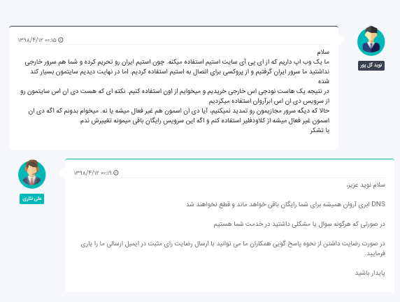
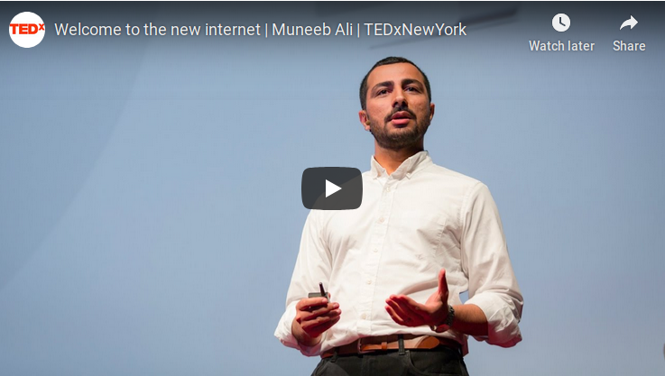

چند وقتیه که درحال کار روی پروژه جدیدم هستم. یک شبکه اجتماعی بر بستر بلاکچین
استیم
[استیم](https://steem.com/)
. تا به حال همیشه خدمات DNS رو از
[cloudflare](https://www.cloudflare.com/)
میگرفتم و اگه معیارهای «‌Decentralizaion»‌ام رو کنار میزاشتم،‌ راضی هم بودم.

اما اینبار که خیلی سر و صدای «آروان کلود» رو شنیده بودم، تصمیم گرفتم هم سرور و هم DNS ام رو از اونها بگیرم.
ظاهر سایت بسیار حرفه ای بود و بهم این حس رو می‌داد که با آدم های حرفه ای کار میکنم. همه چی داشت خوب پیش میرفت که اولین مشکل به وجود اومد.

###اولین مشکل (که البته هیچ ربطی به آروان نداره)

به خاطر تحریم ها مجبور شدیم از سرویس Tor روی سرورمون استفاده کنیم، اما این کار سرعتمون رو خیلی کند کرده بود. درنتیجه تصمیم گرفتیم به یک هاست آلمانی کوچ کنیم.

پس یک تیکت برا‌ی «آروان کلود» ثبت کردم و پرسیدم که اگه دیگه سرورمون رو تمدید نکنیم،‌ می‌تونیم هنوز از خدمات DNS اشون استفاده کنیم یا نه.

#####آروان جواب داد: «DNS ابری آروان همیشه برای شما رایگان باقی خواهد ماند و قطع نخواهد شد.»

همونطور که توی متن می‌بینین، در جواب تیکت من به وضوح گفتن که خدمات دی ان اس رو قطع نخواهند کرد.

از شما چه پنهون من ساده هم حرفشون رو باور کردم و DNS ام رو به کلاودفلیر منتقل نکردم.

###دومین مشکل (اینبار دیگه به آروان مربوطه)

قبل از اینکه به دومین مشکل برسیم بگم که مهلت سرورمون -یا به قول آروانیا «ابرک»مون- تموم شد. طبیعتا آروان قبل از اتمام سرویس تا مدتها بعد از اتمام سرویس یک بند ایمیل زد که: «برو سرویست رو تمدید کن وگرنه همه چیز رو قطع میکنیم»
ما هم که دیگه با سرورمون کاری نداشتیم و اصلا خودمون می‌خواستیم همه چیش قطع بشه کاری به کارش نداشتیم.

###روز واقعه

در روز واقعه هاست آلمانمون اطلاع داد که IP هاست عوض شده و باید از IP جدید استفاده کنیم. ما هم که اصلا سرویس ‌DNS آروان رو برای همین روزها استفاده میکردیم، رفتیم تا ‌IP مون رو عوض کنیم. اما با کمال تعجب دیدم اجازه این کار رو نمیده و میگه:

_اعتبار شما منفیه. اول برو حسابت رو شارژ‌کن!_

من که فکر کردم اشتباهی تو سیستمشون شده رفتم تیکت بزارم بگ:«داداش داری اشتباه میزنی، من بدهی ای ندارم و از طرفی میخوام از سرویس رایگانتون استفاده کنم». اما با کمال تعجب‌تر دیدم، تیکت رو هم اجازه نمیده ثبت کنم و میگه :

_اعتبار شما منفیه. اول برو حسابت رو شارژ‌کن!_

من هنوز همون آدم ساده بودم. پیش خودم فکر کردم سیستمشون باگ داره. بهشون ایمیل زدم که:

_آقا باگ دارین! من شارژ ندارم نمیتونم تیکت ثبت کنم._

البته این ایمیل بهشون رسید و نتونستن بگن «اول برو حسابت رو شارژ کن و بعد بهمون ایمیل بزن». بعدش یکدفه پای یکی از ایمیل هاشون شماره تلفنشون رو دیدم. زنگ زدم و مشکلم رو توضیح دادم. دیدم پشتیبانی میگه شما براتون صورت حساب صادر شده. تا اون رو نپردازین نمیتونین از هیچ کدوم از این خدمات استفاده کنین - و طبیعتا منظورش از این خدمات سرویس رایگان ‌DNS و ارسال تیکت بود.

بعدش با اعتماد به نفس توضیح داد که شما باید ابرکتون رو پاک میکردین،‌ما که نمیتونیم ابرکتون رو پاک کنیم! پس حالا که ابرکتون رو پاک نکردین، اول مشکل مالیتون رو حل کنین و بعد می‌تونین از این خدمات استفاده کنین. اما توضیح نداد:

- چرا وقتی من از سیستمی استفاده نمیکنم و موجودی حسابم هم تموم میشه،‌ سرویس به جای قطع شدن، برام صورت حسابی صادر می‌کنه که باید پرداخت کنم.

- اگه «نمیتونن ابرکم رو پاک کنن!» چرا روزانه به من ایمیل زده می‌شد که اگه حسابت رو شارژ نکنی ابرکت رو پاک می‌کنیم.

- چرا استفاده من از یک سرویس رایگان وابسته به شارژ سرویس دیگه ایم هست.

و مهمتر از همه توضیح نداد:

**چرا وقتی سرویس رایگان کلودفلیر هست،‌ من باید از ابرآروان استفاده کنم که اینقدر غیرحرفه ای رفتار میکنه**

### نتیجه بلاکچینی

> جنگ هفتاد و ملت همه را عذر بنه
>
> چون ندیدند حقیقت ره افسانه زدند

این مشکلات بیشتر از اینکه به آروان کلود و سایر کمپانی های واسطه مربوط بشه، مربوط به معماری اینترنتمونه.

تا وقتی معماری اینترنتمون اینجوریه که ما رو به کمپانی های مختلف وابسته می‌کنه، قدرت دست اون‌هاست و درنتیجه اون‌ها هستن که میتونن **یک‌طرفه** قوانین بزارن و **یک‌طرفه** قوانینشون رو تغییر بدن و **یک‌طرفه** عمل به قوانینشون رو نظارت کنن.

اینجاست که زیبایی شعار بلاکچین «‌BlockStack» رو بهتر درک میکنیم، وقتی در جواب شعار معروف کمپانی گوگل :« Don't be Evil» پاسخ میده:

> بلاکچین Blockstack در حال ساخت اینترنت جدیده. اینترنتی که خدمات کاربرها رو همتا به همتا کنه و اون‌ها رو از سلطه کمپانی‌های واسطه نجات بده

در پایان دعوتتون می‌کنم این سخنرانی فوق العاده «Muneeb Ali» بنیانگذار بلاکچین Blockstack رو با زیرنویس فارسی ببینین:

