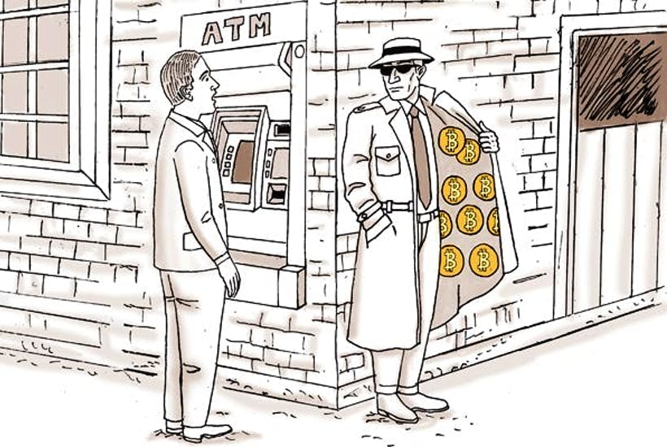
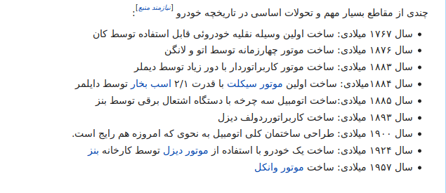
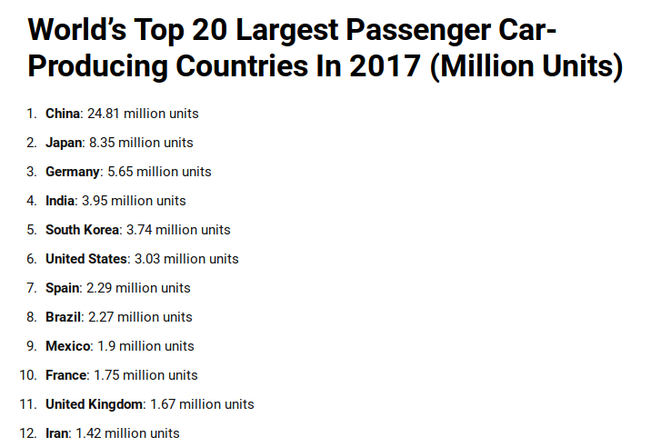
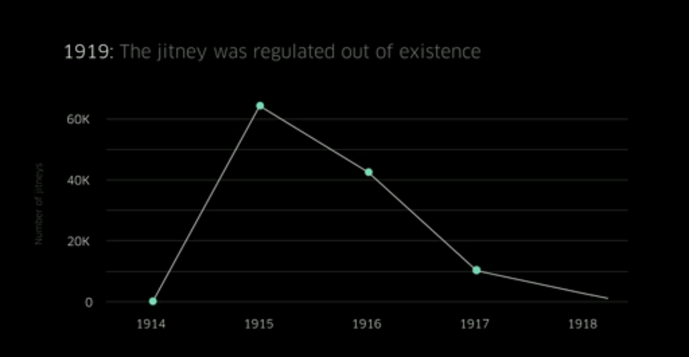

هیئت وزیران طی مصوبه ای «استخراج رمزارزها» رو آزاد و «مبادله با رمزارزها» رو ممنوع کرد. در مورد بخش اولش که آزاد سازی استخراج رمزارزهاست حرف زیادی ندارم. این مصوبه می‌تونه هوشمندانه باشه، اگه با هزینه‌های معقول (هزینه مجوز و مالیات و برق و …) همراه بشه.
اما برای اینکه نتایج «ممنوعیت مبادله با رمزارزها» رو حدس بزنیم به شواهد تاریخی احتیاج داریم. شواهد تاریخی ای از ایران و جهان.

تا قبل از اومدن اینترنت، دولت ها راحت‌تر می‌تونستن چیزی رو ممنوع کنن،‌ پلیس‌هاشون رو بسیج کنن و مطمئن باشن چیزی که قانوناً ممنوع شده،‌ عملاً هم ممنوع می‌مونه. ممکن بود نتایج اون ممنوعیت فاجعه باشه، اما همچنان دولت قدرت ساختن اون فاجعه رو داشت. مثلاً به این مثال‌ها توجه کنین:

##انگلستان، صنعت اتوموبیل، پیش از اینترنت

انگلستان پیشتاز انقلاب صنعتی بود، اونها اولین کسایی بودن که ماشین بخار رو ساختن. روزی نبود که توی انگلستان یک وسیله جدید اختراع نشه، اما وقتی به اتومبیل رسید داستان عوض شد. رسانه‌ها به بدگویی از اتومبیل پرداختن. رسانه‌ها چیزهایی می‌گفتن که البته چندان هم پربیراه نبود. اونها از وسایل نقلیه عجیبی میگفتن که آدم‌های پول‌دار و عجیب سوارش میشن. وسیله ای که مدام خراب میشه و همیشه احتیاج به تعمیر داره. نمیتونه با سرعت اسب حرکت کنه، نمیتونه مثل اسب تو جاده های گلی و جنگلی حرکت کنه. مدام آتیش می‌گیره و جان سرنشینانش و کسایی که بهش نزدیک می‌شن رو به خطر می‌ندازه.

رسانه‌های انگلستان «وضعیت فعلی» اتومبیل ها رو می‌دیدن نه «پتانسیل» اونها رو. چاپ و گسترش اخبار منفی درباره اتومبیل ها، برای رسانه‌ها و افراد مرتبط با بازار اسب – که قدرت‌های سنتی بودن- سودآور بود، اما برای مردم انگلستان تبعات منفی زیادی داشت. تمرکز به معایب این تکنولوژی جدید به جای مزایاش باعث تصویب قانونی عجیب در انگلستان شد.

###قانونی عجیب اما آشنا

در سال ۱۸۹۶ حاکمان انگلستان قانونی رو تصویب کردن که انگلستان رو از کشورهای پیشتاز در صنعت اتومبیل عقب انداخت. بر طبق این قانون که به «پرچم قرمز» معروف شد، هر اتوموبیلی باید الزاماً سه نفر همراه داشت. یک راننده، یک مهندس و یک پرچم دار!

راننده کسی بود که اتومبیل رو هدایت می‌کرد. مهندس - که کاملاً الهام گرفته از صنعت ریلی بود - الزاماً باید توی اتومبیل می‌نشست تا اگه مشکلی برای اون پیش اومد،‌ تعمیرش کنه. و عجیب ترین مورد پرچم دار بود. کسی که باید با یک پرچم قرمز ۱۰۰ یارد جلوتر از اتومبیل راه می‌رفت تا به همه اخطار بده که «ماشین کشنده» داره میاد، فرار کنید!

احتمالا می‌تونین حدس بزنین با تصویب چنین قانونی انگلستان صنعت اتومبیل رو باخت. این قانون عجیب تمام مزیت‌های اتومبیل رو از بین برد – اتوموبیلی که حالا باید با سرعت پرچم دارش حرکت می‌کرد- و انگلستان رو تا مدتها از دستاوردهای صنعت اتومبیل محروم کرد. محرومیتی که تاثیراتش تا به امروز هم باقیه.به قول آندریاس آنتوپولوس:

> اون‌ها غاز رو کشتن. و دیگه خبری از تخم های طلا نبود

حالا اگه به تاریخچه اتومبیل نگاه کنیم، ردی از انگلستان نمی‌بینیم

انگلستان نه تنها در تاریخ اتومبیل نقش کمی داره بلکه با تمام تلاش‌هایی که کرده هنوز هم جایگاه چندان قابل توجهی توی این صنعت نداره:

##آمریکا، صنعت حمل و نقل، پیش از اینترنت

در سال ۱۹۱۴ فردی به نام «ال پی دارپر» اولین کسی بود که ایده تاکسی رو اجرا کرد. دارپر تصمیم گرفت مردمی که نمی‌خواستن توی صف های طولانی ترامواها بایستن رو در ازای ۵ سنت به مقصدشون برسونه. مردم از این ایده استقبال زیادی کردن و به مرور رانندگان دیگه هم به دارپر پیوستن.

این نوآوری به سرعت محبوب شد،‌ به شکلی که در سال ۱۹۱۵ فقط در سیاتل ۵۰‌ هزار جابجایی در روز انجام ‌می‌شد. ۴۵٫۰۰۰ هزار جابجایی در ایالت کانزاس و ۱۵۰٫۰۰۰ جابجابی در لس آنجلس. بد نیست بدونین که اوبر در سال ۲۰۱۶ و در لس آنجلس تنها ۱۵۷٫۰۰۰ جابجایی انجام داد!

صاحبان تراموا برخلاف مردم اصلاً از این تحول جدید خوششون نیومد! پس دست به کار شدن و به همه شهرها در کل کشور رفتن و قوانینی تنظیم کردن که رشد سریع اتوموبیل کرایه ای رو کاهش بدن.

حکومت در همراهی با «تراموایی ها» قوانینی سخت گیرانه برای صنعت نوظهور تاکسی تصویب کرد. در بعضی از شهرها اگه شما راننده ی یک اتوموبیل کرایه ای بودین باید تا ۱۶ ساعت از روز را در اتوموبیل کرایه‌ای می‌موندین! در شهر های دیگه، دو راننده برای یک اتوموبیل کرایه ای نیاز بود و قوانین عجیب و بازدارنده بیشتری که در همراهی با مجوزهای گرون‌قیمت راننده ها رو تحت فشار گذاشتن.

درنهایت صاحبان قدرت‌های سنتی برنده شدن و مردم آمریکا باختن. مردم باختن، نه تنها به این دلیل که فرصت حمل و نقل راحت‌تر رو از دست دادن، نه تنها به این دلیل که امکان درآمد زایی از ماشین‌هاشون رو از دست دادن. بلکه به این دلیل ساده که وقتی نمی‌تونین یک ماشین رو کرایه کنین، باید یکی بخرین!

درنتیجه این ممنوعیت ها مالکیت اتوموبیل به سرعت افزایش پیدا کرد و خیابون های آمریکا مملو از اتوموبیل‌های تک‌سرنشین شد.

امروزه آمریکایی‌ها ۷ میلیارد ساعت از عمرشون، ۱۶۰ میلیارد دلار درآمد و بهره وری و بخش بزرگی از سلامت خودشون رو توی ترافیک از دست می‌دن و بخش بزرگی از زمین و آسمون‌خراش هاشون رو به پارکینگ اتومبیل هایی اختصاص دادن که در ۹۶ درصد اوقات استفاده نمی‌شن!

##ایران، صنعت سرگرمی، قبل از اینترنت

در ایران بعد از انقلاب هم ناگهان صنعت فیلم و موسیقی با چالش های زیادی روبرو شد، اکثراً خوانندگان مطرح اون زمان به خارج از کشور رفتن و زندگی هنریشون رو اونجا دنبال کردن.

وقتی دستگاه‌های VHS (که به اسم ویدئو) میشناسیمشون رسیدن ممنوع شدن و اگه کسی رو با این دستگاه‌ها و احتمالاً یکی دو تا فیلم هندی می‌گرفتن – از جمله پسرعمه من- می‌تونست سر از اوین هم دربیاره. کاملاً به خاطر دارم که اگه یک شب میخواستیم «دورهمی و خانوادگی» فیلم هندی ببینیم یا اجراهای همون خواننده‌های لوس آنجلسی – که بهش «شو» میگفتیم - رو تماشا کنیم، جوانان دلاور فامیل به ماموریت خطرناک تهیه این مواد می‌رفتن.

اون‌ها سراغ دوستان کول و باحالشون -که دیدنشون واسه ما بچه‌ها آرزو بود - میرفتن و «ویدیو» و «شو» هارو توی یک ساک قایم میکردن و مخفیانه از کوچه خیابون رد می‌کردن و به اکثراً سالم به خونه برمیگشتن (البته گاهی هم مثل پسرعمه بی نوای من یک است بازرسی جلوشون رو می‌گرفت و سر از اوین درمیاوردن).

پیدا کردن نوارکاست های اون خواننده‌های لس آنجلسی – که حالا یک صنعت پولساز برای‌ آمریکایی‌ها شده بودن - توی ماشین و خونه هم عواقب بدی داشت. بیرون رفتن دختر و پسرها باهمدیگه ممنوع بود. پوشیدن پیراهن آستین کوتاه و شلوار لی و هرچیز دیگه ای که مد می‌شد ممنوع بود. اون روزها حکومت این قدرت رو داشت که روز به روز عرصه رو بر شادی و آزادی جوون‌ها ببنده.

نتیجه چی شد؟ دولت می‌تونست جلوی تفریح و شادی ملت رو بگیره، اما نمیتونست رفتن استعدادهای ایران که با هزینه بسیار زیاد آموزشی بزرگشون می‌کرد رو هم متوقف کنه. جوونهایی که می‌تونستن به رشد و پیشرفت اقتصاد و فرهنگ این کشور کمک کنن، به آغوش باز کشورهای آزاد پیوستن و ما رو با پدیده «فرار مغزها» آشنا کردن.

امروز ۲۵٪ از کل ایرانیان تحصیل کرده در کشورهای توسعه یافته زندگی می‌کنن و ایران از نظر فرار مغزها در بین ۹۱ کشور در حال توسعه و توسعه نیافته جهان مقام اول رو داره.خروج سالانه ۱۵۰ تا ۱۸۰ هزار ایرانی با تحصیلات عالی از ایران معادل خروج ۱۵۰ میلیارد دلار سرمایه سالیانه از این کشوره.

طبق تحلیل مجله اکونومیست و بر اساس داده‌های صندوق بین‌المللی پول، ۹۶ درصد از اختراع‌های ثبت شده توسط متولدین ایران بین سال‌های ۲۰۰۷ تا ۲۰۱۲ توسط ایرانیان مقیم خارج از کشور انجام شده،‌چنین رقمی برای چین تنها ۱۷ درصده!

> ایران غاز ها رو فراری داد و حالا اون‌ها هم توی کشورهای دیگه ای تخم طلا می‌کنن

##ورود اینترنت و تعبیر شعر شاملو

با اومدن اینترنت کلاً زمین بازی عوض شد. میتونم براتون در این زمینه قلمفرسایی کنم و از mp3 و youtube و چت‌روم و تلگرام و غیره بگم اما با این گفتن چیزهایی که خوب می‌دونین حوصلتون رو سر می‌برم و اصلاً دوس ندارم همچین کاری بکنم. پس به جاش با چارلی بروکر همراهتون میکنم و بهتون اجازه می‌دم هنر اون و سایر همکاراش تو سریال Black Mirror تغییری که اتفاق افتاد رو جلوی چشماتون به حرکت دربیاره.

این شما و این هم شروع طوفانی سریال بلک میرور. جایی که توی یک سکانس تقریباً هشت دقیقه ای، مهمترین درس دنیای جدید به حکومت ها و به مردمی که در سیطره حکومت ها زندگی می‌کنن داده می‌شه – اگه از درس گیرندگان باشند:

چون دوس ندارم فیلم رو اسپویل کنم مجبورم سکوت کنم اما بهتون پیشنهاد می‌کنم حتماً ادامه این اپیزود رو ببینین.ببینین چطور این تیم حکومتی سعی می‌کنن با دستورات بالا به پایین رفتار مردم رو کنترل کنن و هربار ناکام می‌مونن! هیچ فیلمی بهتر از این اپیزود، ناتوانی حکومت ها رو در رابطه با تکنولوژی های جدید به تصویر نکشیده!

##سخنی با حاکمان جهان

اگه درس رو گرفته باشین، میفهمین دورانی که خواسته مردم رو ممنوع می‌کردین و اون‌ها هم اگه دوس نداشتن باهاتون کلنجار می‌رفتن گذشته. زندگی مجازی همه اون دوران رو شست و برد و هرچقدر هم که زندگی ما الکترونیکی تر می‌شه، قدرت و نفوذ شما کمتر می‌شه.

باور نمیکنین تجربه دولتمردان کشور من رو ببینین، تجربه‌هایی مثل «ممنوع کردن موسیقی»، «ممنوع کردن فیلم‌های خارجی» و «ممنوعیت شبکه‌های خارجی». ببینین چطور این کشمکش های پرفشار تموم شد و دیگه کسی اصلا بهشون توجه نمی‌کنه. اینترنت با تمام متعلقاتش مثل استریم کردن و دانلود کردن و … اومد و این کشمکش ها رو به تاریخ سپرد.

به نسل بعدی قوانین اینترنتی توجه کنین، «اجبار به دریافت ای‌نماد»، «اجبار به ثبت وبسایت ها و کانال‌های تلگرامی در فلان جا» و «ممنوع کردن تلگرام» و … واکنش مردم به این قوانین رو ببینین تا باور کنین مردم دیگه جلوی حکومت‌ها نمی‌‌ایستن، نیازی نمی‌بینن، اونها بهشون پوزخند می‌زنن و رد می‌شن.

قصد من تضعیف حکومت نیست. شکی ندارم در مواجه با چالش های مهم دنیای مدرن و برای حفظ دستاوردهای دنیای فعلی و خصوصا در مقابله با کمپانی های تمامیت خواه به حکومت های خوب و کارا احتیاج داریم.

پس لطفا حکومتی باشین که بهش احتیاج داریم، نه حکومتی که بهش پوزخند می‌زنیم.

