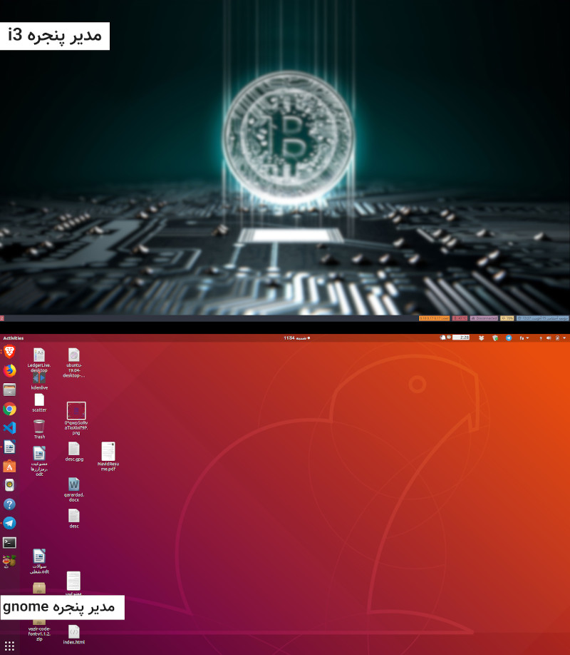

بزرگ شدن تو هر فرهنگی مراحل رشد خودش رو داره که به شکل‌های مختلف ظاهر می‌شه. گاهی با صبر کردن، مثل وقتی که یک بچه به سن بلوغ می‌رسه! گاهی با تلاش سخت، مثل وقتی که یک مبارز کمربند مشکی رشته اش رو به دست می‌یاره. گاهی هم ترکیبی از این دوتاست، مثل زمانی که یک سرخپوست نوجوون برای اثبات بلوغش باید به جنگل بره و با یک خرس شکار شده برگرده.

##تولد

لینوکسی‌ها هم لحظات خاص خودشون رو دارن. اولیش تولده و به جشنش «Install Feast» می‌گن. تولد، وقتیه که برای اولین بار یک توزیع لینوکسی رو نصب میکنی و زندگی لینوکسیت آغاز می‌شه.

هرجا صحبت تولد هست پای یک پدر هم وسطه و پدر من
[استالمن](https://fa.wikipedia.org/wiki/ریچارد_استالمن)
بود. یادم نمیاد از کجا شناختمش – شاید
[رادیو گیک](http://www.namlik.me/channel/%D9%BE%D8%A7%D8%AF%DA%A9%D8%B3%D8%AA%20%D8%B1%D8%A7%D8%AF%DB%8C%D9%88%20%DA%AF%DB%8C%DA%A9)
جادی- اما حرف‌ها و گفتگوهای اون بود که من رو شیفته گنو-لینوکس و فلسفه آزادش کرد.

اولین توزیعی که نصب کردم
[trisquel](https://fa.wikipedia.org/wiki/%D8%AA%D8%B1%DB%8C%D8%B3%DA%A9%D9%84)
بود، استالمن گفته بود از توزیع‌های کاملاً آزاد استفاده کنین و من هم میخواستم پدرم بهم افتخار کنه، اما نشد. همون اول تو نصب درایور دانگل وای‌فای به مشکل خوردم و با مهارت پایینی که داشتم نتونستم مشکل رو حل کنم. پس به ویندوز برگشتم، اما بازگشت قهرمانانه ای نبود، دیگه ویندوز رو دوست نداشتم.

بعدها با
[جادی](https://jadi.net/)
مشورت کردم و بهم پیشنهاد کرد از
[اوبونتو](https://fa.wikipedia.org/wiki/%D8%A7%D9%88%D8%A8%D9%88%D9%86%D8%AA%D9%88)
استفاده کنم. گفت اوبونتو کاربران زیادی داره و جواب پرسش‌هات رو می‌تونی به راحتی پیدا کنی. وقتی به اندازه کافی به لینوکس مسلط شدی می‌تونی سراغ توزیع‌های کاملاً آزادی که دوست داری بری.

##کودکی

حرف جادی درست بود. بچه‌های «لاگ اراک» و «لاگ اهواز»، تو کانال‌های تلگرامی‌شون، خیلی کمکم کردن تا رو پای خودم بایستم و کار کردن با اوبونتو رو یاد بگیرم. این دو لاگ رو همیشه به خاطر خواهم داشت،‌ چون دستم رو گرفتن و پابه پا بردن و بهم شیوه راه رفتن آموختن. به کمک اون‌ها بود که تونستم روی پاهای خودم بایستم و نیازهای اوبونتو ایم رو شخصاً برطرف کنم. اما اوبونتو رو همیشه با یک حس دوگانه دوس داشتم.

درسته که اوبونتو، لینوکس رو به زندگی روزانه من آورده بود، ولی پراستفاده ترین توزیع دنیا «همه جایی»تر از اون بود که مال خودم بدونمش. یه جوری بود که انگار «زن» همه است، و نه «زن» من! (تو ذهنم خیلی با این جمله ور رفتم و بالا پایینش کردم تا اگه ضدزنانه است،‌بیانش نکنم، اما به نظرم سالم بود، حالا اگه شما هم خیلی طرفدار زنانی و این جمله رو ضدزنان دیدی، سخت نگیر. قرار نیست اینجا مانیفست بدم. حسم همین بود و با این جمله بهتر می‌تونستم بیانش کنم )

##بلوغ
چند روز پیش محض تنوع، مدیر پنجرم رو عوض کردم و از گنوم به I3 کوچ کردم. مدیر پنجره عجیبی که باید همه چیزش رو خودم تنظیم میکردم. از«Hotkey» هاش گرفته تا «نحوه نمایش پنجره ها توی ورک اسپیس های دسکتاپ» تا «شیوه چینش اطلاعات مربوط به اینترنت و صدا و … در گوشه تصویر» تا حتی «رنگ نمایش اونها!»

حدس میزنم به نظر شما دسکتاپ گنومم قشنگ تره. دسکتاپی که کمپانی کنونیکال دیزاینش کرده و براش پکیج های مناسبی تدارک دیده – پکیج هایی که مجبور بودم توی I3 با سرچ فراوون پیدا، نصب و تنظیم کنم- اما نکته عجیب این بود که خودم i3 رو بیشتر دوس دارم. نه تنها بیشتر از گنوم دوست دارم بلکه با شور و شوق به دوستام نشونش میدادم و توضیح میدادم که :

«رنگ این قسمت رو میبینی؟ خودم توی فلان فایل تعریف کردم»، «این HOTKEY رو خودم تعریف کردم! اوه اوه فکر کنم باید عوضش کنم»، «پکیج فلان رو میدونی؟ نداشت، مجبور شدم خودم نصبش کنم»

عشق و علاقم به دسکتاپ نه چندان زیبایی که خودم ساختمش برام نشانه داشت، نشانه ای که هر دختری با دیدن اولین لکه های خون توی شرتش دریافت می‌کنه! «بلوغ». و این نشانه خبر می‌ده که مرحله بعدی زندگی فرارسیده.

##بلوغ مهارتی

اقدامی که مثل جشن بلوغ بعضی قبایل سرخپوستیه. وقتی سرخپوست نوجوون به دل جنگل می‌زنه و با یک خرس شکار شده برمی‌گرده و به همه اعلام می‌کنه که دیگه مرد شده. یک «بچه» به جنگل میره و یک «مرد» برمی‌گرده. تو فرهنگ لینوکسی این اقدام می‌تونه نصب یک توزیع مینیمال مثل «آرچ» باشه. توزیعی که نصب همه پکیج ها و تنظیماتش به عهده خودته. توزیعی که نمیتونی نصبش کنی اگه به اندازه کافی به لینوکس مسلط نباشی و نمی‌تونی دوسش نداشته باشی، اگه به اندازه‌ای بالغ شده باشی که دیگه از «ساختن» لذت ببری و نه از «مصرف کردن»!

##بلوغ اخلاقی

بلوغ اخلاقی آخرین مرحله تکامل لینوکسیه. وقتیه که دونستن تفاوت بین «نرم افزار آزاد» با «نرم افزارهای انحصاری» و حتی «اپن سورس»برات کافی نیست. ارزش‌های اخلاقیت فراتر رفته و حالا نسبت به یک زندگی آزاد احساس تعهد می‌کنی. زمانیه که حاضری هزینه آزادی رو بدی و از هر پکیج غیرآزادی پرهیز کنی. اون روز، روزیه که به بلوغ اخلاقی رسیدی و یک توزیع کاملاً آزاد رو نصب میکنی. توزیع آزادی که شاید واسه من trisquel باشه!

پ.ن: لیست لینوکس‌های
[آزاد](https://www.gnu.org/distros/free-distros.en.html)
رو میتونی از اینجا پیدا کنی.
