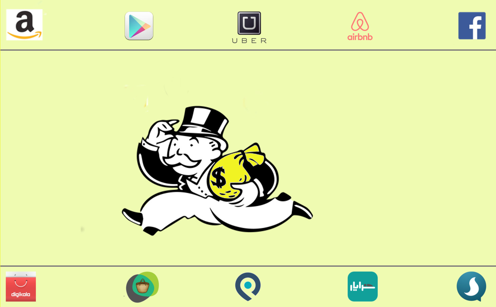

## عصر اعتماد
در بیشتر تاریخ بشر، معاملات انسان‌ها به صورت نفر به نفر (peer to peer) انجام می‌شد. فعالیت‌هایی مثل پول قرض دادن، امانت دادن اجناس و حتی در اختیار گذاشتن مهارت ها فقط زمانی اتفاق می‌افتاد که دوستی و اعتماد بین افراد وجود داشت. به عبارت دیگه آدما وقتی اجناس یا مهارت هاشون رو به هم میدادن که همدیگه رو از قبل میشناختن و باهم در تماس بودن.

## تولید انبوه
 بعد از انقلاب صنعتی و به وجود آمدن کمپانی ها، معامله بر مبنای شناخت به مرور کمرنگ تر شد. در طی دو قرن گذشته  «تولید و توزیع انبوه» بود که اقتصاد ما رو شکل می‌داد. چشم انداز این اقتصاد،‌ جهانی پر از فراوانی منابع اقتصادی،‌ فکری و فیزیکی بود که توسط تولیدکننده‌ها و سرویس دهنده های «متمرکز» ایجاد می‌شد. این واحد های اقتصادی متمرکز می‌تونستن مثل بانک ها و دولت ها صاحبان پول باشند یا مثل کارخانجات صاحبان کالاهای مصرفی باشن یا مثل هتل‌ها صاحبان کالاهای خدماتی.
الگویی که تو همه این اشکال مشترکه «ارزشیه که در نقطه‌ای به وجود میاد و توسط مصرف کنندگان انبوه استفاده میشه»
منافعی که این روش برای تولیدکنندگان به وجود می‌آورد غیر قابل تصور بود. همین منافع بود که اون ها رو وامی‌داشت کارخانجات بزرگ‌تر و بزرگ‌تری بسازن تا تولید رو انبوه و انبوه تر کنن. شرکت ها و کارخانجات عظیم و چند ملیتی وجه مشخصه اقتصاد این دوران هستن.
مثلاً اگه تو این دوره می‌خواستید هزاران توریست رو میزبانی کنید باید سرمایه‌گذاری عظیمی میکردید و ده‌ها هتل بزرگ و مجهز راه می‌انداختید و صدها نفر رو به استخدام در می‌آوردید و اگه میتونستید این حجم نیرو و سرمایه رو خوب مدیریت کنید، به احتمال زیاد اینقدر قوی می‌شدید که هیچ سرمایه گذار خرده پایی نتونه بازارتون رو تهدید کنه.
یا اگه میخواستید میلیون‌ها مسافر رو جابجا کنید باید به همون شکل برای خرید هزاران خودرو سرمایه‌گذاری می‌کردید و به همون شکل نتیجه سرمایه‌گذاری هنگفتتون رو میگرفتید.
اگه بخوایم این دوره رو در یک جمله خلاصه کنیم، میتونیم بگیم: «خیلی سرمایه بزار تا خیلی سود کنی»
بزرگترین منتقد این عصر «کارل مارکس» بود که دنیا رو متوجه برتری «سرمایه» بر «کار» کرد. مارکس متوجه شد که تو همچین سیستمی منافع ناشی از تولید محصول جدید به کسی میرسه که سرمایه رو آورده و کسی که نیروی کار و تخصصش رو آورده منافع ناچیزی می‌بره.
مارکس یک مبارزه فکری بزرگ رو بر علیه این بی‌عدالتی به راه انداخت و اعلام کرد:
>
 چون «کار اصلی» رو کارگران کارخونه ها انجام میدن و «نفع اصلی» رو کسی میبره که «صاحب ابزار تولید» هست،‌ پس این کارگران هستند که باید «صاحبان ابزار تولید» باشن و اگه غیر از این باشه،‌ سرمایه داران همه سود رو برای خودشون برمیدارن و به کارگران در حدی حقوق میدن که از گرسنگی نمیرن.
>
تلاش‌های مارکس و پیروانش منافع بسیاری برای کارگران داشت. اتحادیه های کارگری،‌ قوانین استخدام و اخراج، محدودیت ساعت کار، تعطیلات آخر هفته و خیلی از قوانینی که امروزه از کارگران حمایت میکنن، نتیجه تلاش و مبارزه اون دوران کارگران جهان هستن.

### Donec hendrerit laoreet risus eget adipiscing.

Nullam eros mi, mollis in sollicitudin non, tincidunt sed enim. Sed et felis metus, rhoncus ornare nibh. Ut at magna leo. Suspendisse egestas est ac dolor imperdiet pretium. Lorem ipsum dolor sit amet, consectetur adipiscing elit. Nam porttitor, erat sit amet venenatis luctus, augue libero ultrices quam, ut congue nisi risus eu purus. Cras semper consectetur elementum. Nulla vel aliquet libero. Vestibulum eget felis nec purus commodo convallis. Aliquam erat volutpat.

